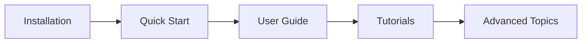

# Getting Started

PRISM automates the setup of protein-ligand molecular dynamics systems for GROMACS.

!!! example "Quick Start"
    ```bash
    git clone https://github.com/AIB001/PRISM.git && cd PRISM
    pip install -e .
    prism protein.pdb ligand.mol2 -o my_system
    ```

## Choose Your Path

<div class="grid cards" markdown>

-   :material-download:{ .lg .middle } **[Installation](installation.md)**

    ---

    Install GROMACS, Python dependencies, and PRISM itself

-   :material-rocket-launch:{ .lg .middle } **[Quick Start](quickstart.md)**

    ---

    Build your first protein-ligand system in under 5 minutes

</div>

## Prerequisites

Before you begin, ensure you have:

- **Python 3.8+** installed (3.10 recommended)
- **GROMACS 2024.3+** installed and sourced
- A protein PDB file and a ligand MOL2/SDF file

## Learning Path



### For Beginners

!!! tip "New to PRISM?"
    1. Follow the [Installation](installation.md) guide
    2. Run through the [Quick Start](quickstart.md) with your own files
    3. Read the [Basic Tutorial](../tutorials/basic-tutorial.md) for a step-by-step walkthrough

### For Experienced Users

!!! info "Coming from other MD tools?"
    - Jump to [Force Fields Guide](../user-guide/force-fields.md) for supported options
    - See [PMF Calculations](../user-guide/pmf-calculations.md) for binding free energy
    - Browse the [API Reference](../api/index.md) for scripting

## Troubleshooting

Having issues? Check these resources:

- [Common Installation Issues](installation.md#troubleshooting)
- [User Guide Troubleshooting](../user-guide/troubleshooting.md)
- [GitHub Issues](https://github.com/AIB001/PRISM/issues)

<div class="whats-next" markdown>

## What's Next

- [Install PRISM and its dependencies](installation.md)
- [Build your first system in the Quick Start guide](quickstart.md)
- [Explore the User Guide for in-depth documentation](../user-guide/index.md)

</div>
