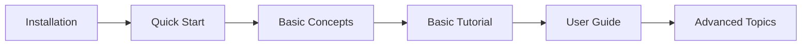

# Getting Started

Welcome to PRISM! This guide will help you get up and running with PRISM quickly and efficiently.

## 🎯 What You'll Learn

This section covers everything you need to know to start using PRISM:

<div class="grid cards" markdown>

-   :material-download:{ .lg .middle } **[Installation](installation.md)**

    ---

    System requirements, installation methods, and verification steps

-   :material-rocket-launch:{ .lg .middle } **[Quick Start](quickstart.md)**

    ---

    Your first PRISM analysis in under 5 minutes

-   :material-book-education:{ .lg .middle } **[Basic Concepts](concepts.md)**

    ---

    Understanding PRISM's core concepts and architecture

</div>

## 📋 Prerequisites

Before you begin, ensure you have:

- **Python 3.8 or higher** installed on your system
- **Basic knowledge** of Python programming
- **Molecular dynamics data** (optional, we provide sample data)

## 🚀 Quick Start Path

If you're eager to get started, follow this quick path:

1. **Install PRISM** using pip:
   ```bash
   pip install prism-md
   ```

2. **Verify installation**:
   ```python
   import prism
   print(prism.__version__)
   ```

3. **Run your first analysis**:
   ```python
   from prism.examples import load_sample_data
   from prism.analysis import quick_analysis
   
   # Load sample data
   traj = load_sample_data('protein')
   
   # Run quick analysis
   results = quick_analysis(traj)
   results.summary()
   ```

## 📚 Learning Resources

### For Beginners

!!! tip "New to Molecular Dynamics?"
    If you're new to molecular dynamics analysis, we recommend:
    
    1. Start with the [Basic Concepts](concepts.md) guide
    2. Follow the [Basic Tutorial](../tutorials/basic-tutorial.md)
    3. Explore [Simple Examples](../examples/simple.md)

### For Experienced Users

!!! info "Coming from other MD tools?"
    If you're experienced with tools like MDAnalysis or MDTraj:
    
    - Check our [Migration Guide](migration-guide.md)
    - Jump to [Advanced Analysis](../tutorials/advanced-analysis.md)
    - Explore the [API Reference](../api/index.md)

## 🎓 Tutorial Pathway

We recommend following this learning pathway:



## 💡 Tips for Success

!!! success "Best Practices"
    - **Start small**: Begin with simple analyses before moving to complex workflows
    - **Use sample data**: Practice with our provided datasets before using your own
    - **Read error messages**: PRISM provides detailed error messages to help you debug
    - **Join the community**: Ask questions in our [GitHub Discussions](https://github.com/username/PRISM/discussions)

## 🔧 Troubleshooting

Having issues? Check these resources:

- [Common Installation Issues](installation.md#troubleshooting)
- [FAQ](../about/faq.md)
- [GitHub Issues](https://github.com/username/PRISM/issues)

## 📊 Sample Datasets

PRISM comes with several sample datasets for learning:

| Dataset | Description | Size | Use Case |
|---------|-------------|------|----------|
| `protein` | Small protein in water | 10 MB | Basic analysis |
| `membrane` | Lipid bilayer system | 50 MB | Membrane analysis |
| `polymer` | Polymer chain | 5 MB | Polymer analysis |
| `crystal` | Crystal structure | 2 MB | Solid-state analysis |

Load them using:
```python
from prism.examples import load_sample_data
traj = load_sample_data('protein')  # or 'membrane', 'polymer', 'crystal'
```

## 🎉 Ready to Begin?

<div class="grid" markdown>

[Install PRISM :material-arrow-right:](installation.md){ .md-button .md-button--primary }
[Quick Start Guide :material-arrow-right:](quickstart.md){ .md-button }

</div>

---

!!! question "Need Help?"
    If you encounter any issues or have questions:
    
    - 📧 Email: [zhaoqi.shi@wisc.edu](mailto:zhaoqi.shi@wisc.edu)
    - 💬 GitHub Discussions: [Community Forum](https://github.com/username/PRISM/discussions)
    - 🐛 Bug Reports: [GitHub Issues](https://github.com/username/PRISM/issues)