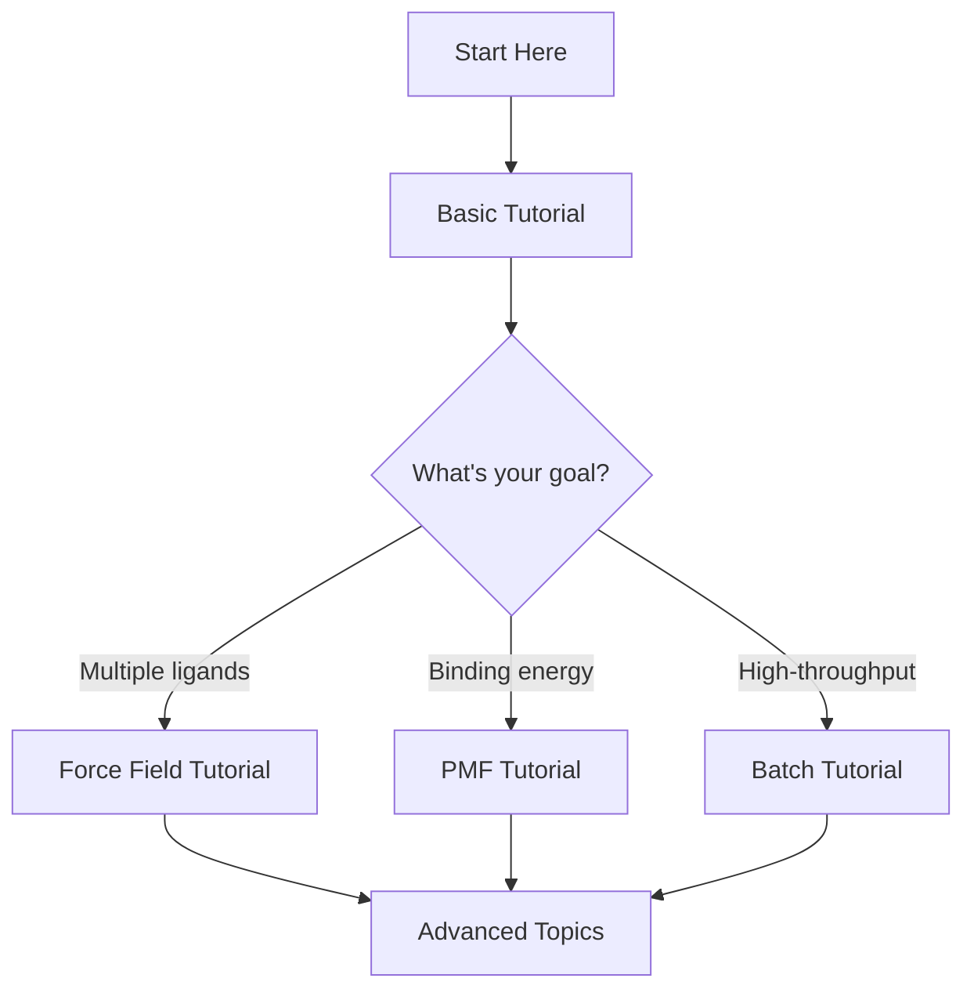

# Tutorials

Welcome to the PRISM tutorials! These hands-on guides will walk you through common workflows and best practices for building and analyzing protein-ligand MD systems.

## Available Tutorials

### [Basic Tutorial](basic-tutorial.md)
**Level:** Beginner
**Time:** 30-60 minutes
**Topics:** System building, running simulations, basic analysis

Learn the fundamentals of PRISM by building a simple protein-ligand system from start to finish. This tutorial covers the complete workflow from input preparation to trajectory analysis.

**What you'll learn:**
- Preparing protein and ligand inputs
- Building an MD system with default settings
- Running equilibration and production simulations
- Analyzing protein-ligand interactions
- Visualizing results

---

### [Force Field Selection Tutorial](force-field-tutorial.md)
**Level:** Intermediate
**Time:** 45-90 minutes
**Topics:** Multiple force fields, comparison, validation

Explore PRISM's support for 8+ ligand force fields. Learn how to choose the right force field for your system and compare results across different parameterization methods.

**What you'll learn:**
- When to use GAFF vs OpenFF vs OPLS-AA
- Building the same system with multiple force fields
- Comparing binding energies and structural stability
- Validating force field quality
- Best practices for force field selection

---

### [PMF Calculation Workflow](pmf-tutorial.md)
**Level:** Advanced
**Time:** 2-4 hours (+ computation time)
**Topics:** Binding free energy, PMF, umbrella sampling

Complete walkthrough of calculating protein-ligand binding free energies using umbrella sampling and WHAM analysis.

**What you'll learn:**
- Setting up PMF calculations
- Running steered MD and umbrella sampling
- Analyzing PMF profiles with WHAM
- Calculating binding free energies
- Troubleshooting common PMF issues

---

### [Batch Processing Tutorial](batch-tutorial.md)
**Level:** Intermediate
**Time:** 60-90 minutes
**Topics:** High-throughput, automation, parallel processing

Learn how to process multiple protein-ligand complexes efficiently using PRISM's Python API and cluster resources.

**What you'll learn:**
- Automating system building for multiple ligands
- Submitting batch jobs to compute clusters
- Processing results from multiple simulations
- Creating comparison reports
- Best practices for high-throughput screening

---

## Tutorial Prerequisites

### Required Software

All tutorials assume you have:

- PRISM installed and configured ([Installation Guide](../getting-started/installation.md))
- GROMACS 2020.x or newer
- Python 3.8+
- Basic command-line familiarity

### Optional Software

Some tutorials may benefit from:

- MDTraj (for advanced analysis)
- RDKit (for ligand handling)
- Jupyter notebooks (for interactive analysis)

### Sample Data

Download tutorial data:

```bash
# Clone the PRISM tutorial data repository
git clone https://github.com/AIB001/PRISM-tutorial-data.git
cd PRISM-tutorial-data

# Or download specific tutorial datasets
wget https://github.com/AIB001/PRISM-tutorial-data/raw/main/basic_tutorial.tar.gz
tar -xzf basic_tutorial.tar.gz
```

## Learning Path



### For Beginners

1. Start with the [Basic Tutorial](basic-tutorial.md)
2. Review the [User Guide](../user-guide/index.md) for deeper understanding
3. Try the [Force Field Tutorial](force-field-tutorial.md) to explore options

### For Intermediate Users

1. Complete the [Force Field Tutorial](force-field-tutorial.md)
2. Learn [Batch Processing](batch-tutorial.md) for efficiency
3. Explore [Examples](../examples/index.md) for specific use cases

### For Advanced Users

1. Master [PMF Calculations](pmf-tutorial.md)
2. Study the [API Reference](../api/index.md) for custom workflows
3. Contribute your own examples!

## Tutorial Format

Each tutorial follows this structure:

- **Objectives**: What you'll accomplish
- **Prerequisites**: What you need before starting
- **Step-by-step instructions**: Detailed walkthrough
- **Expected output**: What results to expect
- **Troubleshooting**: Common issues and solutions
- **Next steps**: Where to go from here

## Getting Help

If you encounter issues while following tutorials:

1. **Check the [Troubleshooting Guide](../user-guide/troubleshooting.md)**
2. **Review error messages carefully** - they often indicate the problem
3. **Verify dependencies** with `prism.check_dependencies()`
4. **Ask for help**:
   - GitHub Issues: [AIB001/PRISM](https://github.com/AIB001/PRISM/issues)
   - Email: zhaoqi.shi@wisc.edu

## Contributing Tutorials

Have a useful workflow or case study to share? We welcome tutorial contributions!

**To contribute:**

1. Fork the [PRISM-Tutorial repository](https://github.com/AIB100/PRISM-Tutorial)
2. Add your tutorial following our format
3. Include sample data if needed
4. Submit a pull request

**Good tutorial topics include:**

- Specific protein families (kinases, GPCRs, etc.)
- Special cases (metal-binding, covalent inhibitors)
- Integration with other tools
- Advanced analysis techniques
- Optimization strategies

## Additional Resources

### Video Tutorials

- [PRISM YouTube Channel](https://youtube.com/PRISMmd) (coming soon)
- [Webinar Series](https://prism-tutorial.com/webinars) (coming soon)

### Publications

See [Publications](../about/publications.md) for research using PRISM and theoretical background.

### Example Systems

Browse the [Examples](../examples/index.md) section for ready-to-use configurations and workflows.

## Quick Reference

| Tutorial | Level | Time | Key Skills |
|----------|-------|------|------------|
| [Basic](basic-tutorial.md) | Beginner | 30-60 min | System building, MD simulation |
| [Force Fields](force-field-tutorial.md) | Intermediate | 45-90 min | Force field selection, comparison |
| [PMF](pmf-tutorial.md) | Advanced | 2-4 hours | Binding energy, umbrella sampling |
| [Batch](batch-tutorial.md) | Intermediate | 60-90 min | Automation, high-throughput |

---

Ready to get started? Begin with the [Basic Tutorial](basic-tutorial.md) or jump to a topic that interests you!
