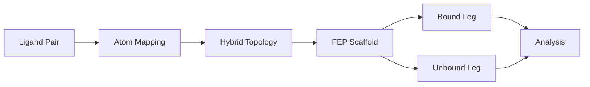
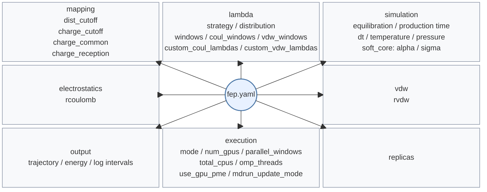

# FEP Calculations

PRISM automates **Free Energy Perturbation (FEP)** calculations for relative binding free energies between similar ligands using GROMACS hybrid topologies.

!!! example "Quick Start"
    ```bash
    prism protein.pdb ligand_ref.mol2 -o fep_output \
      --fep \
      --mutant ligand_mut.mol2 \
      --ligand-forcefield gaff2 \
      --forcefield amber14sb_OL15 \
      --fep-config fep.yaml
    ```

If you want the full YAML parameter reference, jump directly to [FEP YAML Reference](#fep-yaml-reference).

## Overview

PRISM's FEP workflow consists of five stages:



1. **Atom Mapping**: distance-based matching between the reference and mutant ligands
2. **Hybrid Topology**: one ligand topology with A/B-state parameters
3. **FEP Scaffold**: bound and unbound system setup, MDP generation, and run scripts
4. **Lambda Windows**: per-window equilibration and production inputs
5. **Analysis**: BAR, MBAR, and TI estimators over the window data

## Mapping and Hybrid Topology

### Distance-Based Atom Mapping

PRISM maps atoms using geometry and element identity, with optional charge-based filtering.


### Atom Classes

PRISM classifies atoms as:

- **Common atoms**: shared between both ligands
- **Transformed atoms**: only present in state A or only in state B
- **Surrounding atoms**: retained in the hybrid representation but handled with state-specific parameters near the mutation region

### Charge Redistribution

**Why charge redistribution matters**: FEP calculations measure free energy differences by alchemically transforming one ligand into another. In practice, smaller and more local perturbations usually improve phase-space overlap and make the calculation easier to converge.

When atoms are classified as **common** (shared between both ligands), keeping their electrostatic properties as consistent as possible usually reduces the magnitude of the alchemical transformation. This often leads to:

- **Better convergence** — fewer lambda windows needed for adequate overlap
- **Lower variance** — smaller statistical uncertainty in the final ΔG
- **Improved physical realism** — common regions should behave consistently in both states

PRISM implements this through two complementary mechanisms:

1. **`charge_common`**: Controls how shared atoms inherit charge information
2. **`charge_reception`**: When atoms transform, PRISM redistributes the compensating charge so that the end states remain consistent with the initial total charge

| Parameter | Default | Meaning |
|---|---:|---|
| `dist_cutoff` | `0.6 nm` | Distance cutoff for candidate atom matches. |
| `charge_cutoff` | `0.05` | Charge-difference filter used during mapping/classification. |
| `charge_common` | `mean` | Default shared-atom charge strategy. |
| `charge_reception` | `surround` | Default redistribution target for compensating charge. |

!!! note
    PRISM uses GROMACS-style length units internally. A mapping cutoff of `0.6` means **0.6 nm**, not 0.6 Å.

For detailed parameter descriptions, charge options, and allowed redistribution modes, see the [`mapping` section](#mapping-section) below.

For the current GROMACS discussion of free-energy pathways, end states, and interaction handling, see the current GROMACS free-energy implementation and interaction references.[^gmx-free-energy-impl] [^gmx-free-energy-interactions]

### Hybrid Topology

The generated `hybrid.itp` stores both state A and state B parameters in a single molecule description. In GROMACS this means the **end states** are encoded in the topology, while the **path** between them is controlled by the lambda schedule in the generated MDP files.

For the current GROMACS description of free-energy end states, lambda vectors, and interaction handling, see the current manual and the free-energy reference sections.[^gmx-current] [^gmx-free-energy-impl] [^gmx-free-energy-interactions] The `gmx grompp` manual also documents `-rb` for B-state reference coordinates.[^gmx-grompp]

## Lambda Schedules

PRISM currently supports three lambda schedule strategies. The exact keys and defaults are listed in the [`lambda` section](#lambda-section) of the FEP YAML Reference.

PRISM-generated MDPs write separate lambda vectors for:

| Lambda vector | Role |
|---|---|
| `coul-lambdas` | Controls electrostatic transformation. |
| `vdw-lambdas` | Controls van der Waals transformation. |
| `bonded-lambdas` | Controls bonded-term interpolation. |
| `mass-lambdas` | Controls mass interpolation. |

This means the implementation is more specific than a single scalar lambda applied uniformly to all interaction terms.[^gmx-free-energy-impl] [^gmx-free-energy-interactions]

### Supported schedule modes

| Mode | Default? | Meaning |
|---|---|---|
| `decoupled` | yes | Coulomb transforms first, then VDW transforms. |
| `coupled` | no | Coulomb and VDW follow the same schedule together from 0 to 1. |
| `custom` | no | User supplies explicit `custom_coul_lambdas` and `custom_vdw_lambdas`. Shorter arrays are padded with their final value. |

The following figure visualizes the three lambda schedule modes:

<p align="center">
  
</p>

#### Figure explanation

- `Decoupled` (default): a two-stage path where Coulomb (red) completes first (windows 0-11), followed by VDW (blue) (windows 12-31). Bonded (gray dashed) and mass (green dotted) follow the Coulomb schedule.
- `Coupled`: Coulomb and VDW change together across all 32 windows and therefore share the same lambda progression.
- `Custom`: user-supplied arrays can place Coulomb and VDW transitions at different points; the example here shows an earlier Coulomb jump and a later VDW transition.

### Supported distributions

The following figure compares the three supported point distributions using 32 lambda points:

<p align="center">
  
</p>

| Distribution | Default? | Meaning |
|---|---|---|
| `linear` | no | Uniform spacing, i.e. `linspace(0, 1, n_points)`. |
| `nonlinear` | yes | PRISM's empirical endpoint-dense reference schedule: a fixed 32-point table, subsampled for fewer points and interpolated for more points. |
| `quadratic` | no | An empirical symmetric power-law family with tunable endpoint bias; use it when you want more or fewer points near $\lambda=0$ and $\lambda=1$ without writing explicit custom arrays. |

For the `quadratic` family, PRISM uses the empirical symmetric piecewise definition

$$
\lambda(x)=
\begin{cases}
\dfrac{1}{2}(2x)^p, & x \le 0.5 \\
1 - \dfrac{1}{2}\left(2(1-x)\right)^p, & x > 0.5
\end{cases}
$$

where $p$ is the `quadratic_exponent`. This is an empirical schedule-shaping parameter rather than a theoretically unique optimum. The historical behavior corresponds to `quadratic_exponent: 2.0`; larger values make the endpoints denser and the middle sparser. If you need exact placement, use `custom_coul_lambdas` and `custom_vdw_lambdas` instead. The figure above overlays both the default `p=2` curve and a stronger `p=4` example.

Current GROMACS references for lambda schedules and interaction-specific lambda control are the free-energy implementation and interaction chapters.[^gmx-free-energy-impl] [^gmx-free-energy-interactions]

## Build Workflow

### Build the Scaffold

```bash
prism protein.pdb ligand_ref.mol2 -o fep_output \
  --fep \
  --mutant ligand_mut.mol2 \
  --ligand-forcefield gaff2 \
  --forcefield amber14sb_OL15 \
  --fep-config fep.yaml
```

PRISM then:

1. maps the ligand pair and generates the mapping report
2. builds the hybrid topology and `hybrid.gro`
3. prepares the **bound** leg (protein + hybrid ligand)
4. prepares the **unbound** leg (hybrid ligand in solvent), reusing the bound-leg box vectors so the two legs are scaffolded with the same box dimensions

### Generated Execution Scripts and Configuration

PRISM then generates the execution environment for both legs:

1. **writes per-leg helper scripts** - `run_prod_standard.sh` and `run_prod_repex.sh` for each leg
2. **writes a root-level `run_fep.sh`** - creates the master execution script that drives the entire workflow
3. **writes per-window MDPs** - generates lambda-specific MDP files for each window
4. **writes `fep_scaffold.json`** - a scaffold manifest for inspection/debugging (the normal run path does not currently depend on reading it back)

### Execution Workflow

For each leg, PRISM prepares the following execution stages:

1. **leg-level equilibration** - EM, NVT, NPT stages for each leg
2. **per-window relaxation** - each lambda window receives its own short lambda-specific relaxation (`em_short`, `npt_short`) before production
3. **production execution** - final production runs (`prod`) for each lambda window

This means each lambda window is not launched directly from the leg-level NPT state; it first receives its own short lambda-specific relaxation.

This is PRISM's generated workflow for robustness and restartability. It is an implementation choice, not a GROMACS-imposed universal FEP sequence.

### Generated MDP Behavior

The generated per-window MDPs currently include:

| MDP item | Current behavior |
|---|---|
| `init-lambda-state` | Set to the current window index. |
| `calc-lambda-neighbors` | `-1` in window-level equilibration and production templates. |
| Lambda vectors | Explicit `coul-lambdas`, `vdw-lambdas`, `bonded-lambdas`, and `mass-lambdas` are written. |
| Soft-core settings | `sc-alpha` and `sc-sigma` are included in the generated templates. |

For the current GROMACS description of these free-energy controls, see the free-energy implementation and interaction chapters.[^gmx-free-energy-impl] [^gmx-free-energy-interactions]

## Running FEP

```bash
cd fep_output/GMX_PROLIG_FEP

bash run_fep.sh bound
bash run_fep.sh unbound
bash run_fep.sh all
```

If the scaffold contains multiple replicas, the root script also supports:

```bash
bash run_fep.sh bound1
bash run_fep.sh unbound2
bash run_fep.sh bound1-3
```

### Production Modes

| Mode | Meaning | Notes |
|---|---|---|
| `standard` | Run windows independently. | `parallel_windows` controls concurrency; GPUs are assigned round-robin across windows. |
| `repex` | Run lambda replica exchange. | PRISM writes `run_prod_repex.sh` and launches production with `gmx_mpi -multidir`. |

## Analysis

PRISM generates two different HTML outputs in a typical FEP workflow:

1. `common/hybrid/mapping.html`
   - generated during scaffold construction
   - used to inspect atom correspondence, transformed/surrounding/common classes, charges, and the hybridization result before running MD
2. `fep_analysis_report.html` or `fep_multi_estimator_report.html`
   - generated after production analysis
   - used to inspect overlap matrices, convergence behavior, repeat statistics, and estimator agreement

The two reports answer different questions: `mapping.html` checks whether the hybrid system is chemically and topologically sensible, while the analysis report checks whether the resulting FEP simulation is numerically well behaved.

PRISM analyzes FEP results using three established free energy estimators:

| Estimator | Full Name | Description | Use Case |
|---|---|---|---|
| **TI** | Thermodynamic Integration | Numerical integration of ∂H/∂λ across windows | Good for smooth transformations with well-sampled gradients |
| **BAR** | Bennett Acceptance Ratio | Optimal overlap between neighboring windows | Robust for standard FEP with adequate sampling |
| **MBAR** | Multistate BAR | Uses all data simultaneously with reweighting | Most efficient; provides overlap matrix for quality control |

### Analysis workflow

1. PRISM reads `dhdl.xvg` files from each `window_*` directory (contains ∂H/∂λ time series)
2. For each leg (bound/unbound), computes ΔG and uncertainty using the selected estimator(s)
3. Binding free energy is reported as

   $$
   \Delta G_{\mathrm{bind}} = \Delta G_{\mathrm{unbound}} - \Delta G_{\mathrm{bound}}
   $$

4. Bootstrap analysis provides error estimates (controlled by `--bootstrap-n-jobs`)
5. HTML report includes overlap matrices, convergence plots, and estimator comparison

### HTML Reports

#### Mapping Report

PRISM writes a mapping report as `common/hybrid/mapping.html` during scaffold construction.

You should expect this file to appear as soon as the scaffold has been built, before any MD is run.

Use this report to inspect:

- whether the common core is chemically local and reasonable
- whether transformed atoms are where you expect them to be
- whether charges and atom labels look plausible
- whether any obviously incorrect long-range swaps or unknown atoms appear

The report contains:

- a top control bar for coloring mode, charge display, atom labels, and export
- two aligned ligand views so the mapped atoms can be compared side by side
- a legend summarizing common, transformed, and surrounding atoms
- an atom-detail table that lists the correspondence and classification for both ligands

This is the first checkpoint in the workflow. If the mapping report looks chemically wrong, there is no value in proceeding to production runs.

**First checkpoint:** verify the mapping report before starting EM/NVT/NPT or production windows.

<p align="center">
  
</p>

*Example mapping report showing classification controls, aligned ligands, and the atom-detail table.*

#### Analysis Report

After the simulation has produced window-level `dhdl.xvg` files, `prism --fep-analyze` generates an HTML analysis report. For a single estimator this is typically `fep_analysis_report.html`; for multi-estimator comparison it is often named `fep_multi_estimator_report.html`, although the exact filename is controlled by `--output`.

This file appears only after analysis has been run. In typical usage, place it in the `GMX_PROLIG_FEP/` root or another user-chosen output location via `--output`.

Use this report to inspect:

- $\Delta G$ and $\Delta\Delta G$ summary values
- overlap quality between neighboring windows
- convergence over time
- bootstrap uncertainty
- repeat-to-repeat consistency
- agreement or divergence between TI, BAR, and MBAR

The report typically contains:

- a summary panel with $\Delta G$ for each leg and the final $\Delta\Delta G$ estimate
- a comparison table when several estimators are requested
- free-energy profile plots across λ
- time-convergence diagnostics
- overlap information for quality control
- bootstrap and repeat-level statistics when available

<p align="center">
  
</p>

*Example analysis report showing estimator comparison, convergence diagnostics, overlap information, and repeat-level statistics.*

This report is the main result-validation checkpoint. In practice, users should examine:

- whether neighboring windows overlap well enough for reweighting-based estimators
- whether the free-energy estimate stabilizes rather than drifting steadily with simulation time
- whether TI, BAR, and MBAR broadly agree
- whether repeat-to-repeat spread is acceptable for the intended claim

If these diagnostics look poor, the remedy is usually to improve sampling, adjust lambda spacing, or revisit the mapped transformation rather than accepting the $\Delta\Delta G$ value at face value.

**Result-validation checkpoint:** do not interpret a reported $\Delta\Delta G$ without checking overlap, convergence, and estimator agreement.

### Analysis backends

- `alchemlyb` (default): Python library supporting TI/BAR/MBAR; required for multi-estimator mode
- `gmx_bar`: Native GROMACS `gmx bar` command; BAR-only, useful for validation

Example:

```bash
prism --fep-analyze \
  --bound-dir fep_output/GMX_PROLIG_FEP/bound/repeat1 \
  --unbound-dir fep_output/GMX_PROLIG_FEP/unbound/repeat1 \
  --estimator MBAR BAR TI \
  --bootstrap-n-jobs 8 \
  --output fep_results.html \
  --json fep_results.json
```

!!! note
    `prism --fep-analyze` accepts either a single repeat directory (`bound/repeat1`, `unbound/repeat1`) or a leg directory containing `repeat*` subdirectories. When given the leg directory, the CLI now auto-discovers all repeats and performs aggregated analysis across them.

## FEP YAML Reference

If you started from the workflow sections above and now want the exact configuration keys, use the following reference.

### Configuration Map



Mermaid flowcharts do not provide a true radial layout. This map therefore uses Mermaid's block diagram syntax to keep a center node with sections above and below while preserving outward arrows.[^mermaid-block]

### Example `fep.yaml`

```yaml
mapping:
  dist_cutoff: 0.6
  charge_cutoff: 0.05
  charge_common: mean
  charge_reception: surround

lambda:
  strategy: decoupled
  distribution: nonlinear
  quadratic_exponent: 2.0
  windows: 32
  coul_windows: 12
  vdw_windows: 20
  # custom_coul_lambdas: [0.0, 0.2, 0.5, 1.0]
  # custom_vdw_lambdas: [0.0, 0.0, 0.5, 1.0]

simulation:
  equilibration_nvt_time_ps: 500
  equilibration_npt_time_ps: 500
  production_time_ns: 5.0
  dt: 0.002
  temperature: 310
  pressure: 1.0

soft_core:
  alpha: 0.5
  sigma: 0.3

electrostatics:
  rcoulomb: 1.0

vdw:
  rvdw: 1.0

output:
  trajectory_interval_ps: 500
  energy_interval_ps: 10
  log_interval_ps: 10

execution:
  mode: standard
  num_gpus: 4
  parallel_windows: 4
  total_cpus: 56
  omp_threads: 14
  use_gpu_pme: true
  mdrun_update_mode: auto

replicas: 1
```

### `mapping` section

#### `charge_common` modes

| Mode | Meaning |
|---|---|
| `ref` | Keep the reference ligand (state A) charge on common atoms. |
| `mut` | Use the mutant ligand (state B) charge on common atoms. |
| `mean` | Average the A/B charges on common atoms. This is the default because it usually reduces the electrostatic perturbation. |
| `none` | Keep the original per-state charges without averaging common atoms. |

#### `charge_cutoff`

`charge_cutoff` is used after geometric matching. If two candidate atoms are geometrically compatible but their charge difference is larger than the cutoff, PRISM treats them more conservatively during classification instead of assuming they are a clean common-atom match.

#### Charge redistribution modes

The standard user-facing workflow currently supports the following `charge_reception` modes:

| Mode | Default? | Meaning |
|---|---|---|
| `surround` | yes | Redistribute onto atoms surrounding the transformed region. |
| `unique` | no | Redistribute only onto atoms unique to the transformed region. |
| `none` | no | Disable redistribution after common-atom assignment. |

!!! note
    This figure is also used in the PRISM preprint and is included here as a conceptual aid. Exact atom membership in each redistribution set still depends on the current topology and mapping result.

!!! warning
    The lower-level hybrid-topology code contains an experimental `surround_ext` redistribution branch, but the standard distance-based mapping path currently validates only `surround`, `unique`, and `none`. Treat `surround_ext` as internal/experimental rather than a normal documented workflow option.

### `lambda` section

| Key | Default | Meaning |
|---|---:|---|
| `strategy` | `decoupled` | Lambda scheduling mode: `decoupled`, `coupled`, or `custom`. |
| `distribution` | `nonlinear` | Distribution along the schedule: `linear`, `nonlinear`, or `quadratic`. |
| `quadratic_exponent` | `2.0` | Empirical endpoint-bias exponent used when `distribution: quadratic`; larger values give denser endpoints, while `custom_*_lambdas` remains the most explicit option. |
| `windows` | `32` | Total window count for `coupled`, and target total for `decoupled`. |
| `coul_windows` | `12` | Coulomb-stage window count in `decoupled` mode. |
| `vdw_windows` | `20` | VDW-stage window count in `decoupled` mode. |
| `custom_coul_lambdas` | none | Required for `custom`; YAML float list such as `[0.0, 0.2, 0.5, 1.0]` for the Coulomb schedule. See [Example `fep.yaml`](#example-fepyaml). |
| `custom_vdw_lambdas` | none | Required for `custom`; YAML float list such as `[0.0, 0.0, 0.5, 1.0]` for the VDW schedule. See [Example `fep.yaml`](#example-fepyaml). |

If you use only the top-level CLI flag `--lambda-windows`, treat it as a simple convenience override. For reproducible FEP work, prefer an explicit YAML lambda section.

Reference: see the current GROMACS free-energy implementation and interaction chapters.[^gmx-free-energy-impl] [^gmx-free-energy-interactions]

### `simulation` section

| Key | Default | Meaning |
|---|---:|---|
| `equilibration_nvt_time_ps` | `500` | Leg-level NVT equilibration time in ps. |
| `equilibration_npt_time_ps` | `500` | Leg-level NPT equilibration time in ps. |
| `production_time_ns` | `5.0` | Production length per lambda window in ns. |
| `dt` | `0.002` | MD time step in ps. |
| `temperature` | `310` | Simulation temperature in K. |
| `pressure` | `1.0` | Simulation pressure in bar. |

### `soft_core` section

| Key | Default | Meaning |
|---|---:|---|
| `alpha` | `0.5` | Soft-core alpha parameter for alchemical nonbonded interactions. |
| `sigma` | `0.3` | Soft-core sigma parameter in nm. |

### `electrostatics` and `vdw` sections

| Section | Key | Default | Meaning |
|---|---|---:|---|
| `electrostatics` | `rcoulomb` | `1.0` | Requested Coulomb cutoff in nm. |
| `vdw` | `rvdw` | `1.0` | Requested VDW cutoff in nm. |

!!! note
    The generated FEP templates currently use the configured `rcoulomb` and `rvdw` values directly (default `1.0 nm`). Some local smoke-test helper scripts may temporarily rewrite cutoffs for debugging or stability experiments, but that is not the normal scaffold default.

### `output` section

| Key | Default | Meaning |
|---|---:|---|
| `trajectory_interval_ps` | `500` | Trajectory output interval in ps. |
| `energy_interval_ps` | `10` | Energy output interval in ps. |
| `log_interval_ps` | `10` | Log output interval in ps. |

### `execution` section

| Key | Default | Meaning |
|---|---:|---|
| `mode` | `standard` | Production execution mode: `standard` or `repex`. |
| `num_gpus` | `null` | Total GPUs available to generated scripts. |
| `parallel_windows` | `null` | Concurrent windows in `standard` mode; if omitted, scripts fall back to GPU count. |
| `total_cpus` | `null` | Total CPUs available; used to derive OpenMP threads when `omp_threads` is not set. |
| `omp_threads` | `null` | Manual OpenMP thread override per worker/rank. |
| `use_gpu_pme` | `true` | Whether production helpers request `-pme gpu`. |
| `mdrun_update_mode` | `auto` | Runtime update mode: `auto`, `gpu`, `cpu`, or `none`. |
| `use_gpu_update` | `false` | Legacy compatibility switch; current FEP defaults keep GPU-side update off unless explicitly enabled. |

### Top-level key

| Key | Default | Meaning |
|---|---:|---|
| `replicas` | `1` | Number of bound/unbound repeat directories to scaffold. |

## References

[^gmx-current]: [GROMACS current manual](https://manual.gromacs.org/current/).
[^gmx-free-energy-impl]: [GROMACS current reference manual, *Free energy implementation*](https://manual.gromacs.org/current/reference-manual/special/free-energy-implementation.html).
[^gmx-free-energy-interactions]: [GROMACS current reference manual, *Free-energy interactions*](https://manual.gromacs.org/current/reference-manual/functions/free-energy-interactions.html).
[^gmx-grompp]: [GROMACS current online help, `gmx grompp`](https://manual.gromacs.org/current/onlinehelp/gmx-grompp.html).
[^gmx-2026-fe-gpu]: [GROMACS 2026.0 release notes, *Performance improvements*: CUDA support for perturbed non-bonded free-energy kernels on GPU](https://manual.gromacs.org/documentation/2026.0/release-notes/2026/major/performance.html).
[^gmx-2026-fe-gpu-fixes]: [GROMACS 2026.1 release notes: fixes for perturbed non-bonded interactions on GPU](https://manual.gromacs.org/current/release-notes/2026/2026.1.html).
[^mermaid-block]: [Mermaid block diagrams](https://mermaid.js.org/syntax/block.html).

## Troubleshooting

### Mapping looks chemically wrong

- verify protonation and tautomer states first
- prefer MOL2 or SDF when PDB loses bond-order information
- inspect `common/hybrid/mapping.html` before trusting a scaffold

### Windows fail early

- inspect leg-level `build/em.log`, `build/nvt.log`, and `build/npt.log`
- inspect the hybrid files in `common/hybrid/`
- rerun a smoke test before launching long production

### Analysis finds no windows

- pass the repeat directory, not only the FEP root
- confirm that each `window_*` directory contains production outputs such as `prod.*` and `dhdl.xvg`

### Practical Notes

- Prefer an explicit `fep.yaml` for reproducible lambda schedules.
- The CLI still exposes `--lambda-windows`, but it is a simplified override. If you care about exact schedules, define the lambda section explicitly in YAML.
- `execution.mode`, `parallel_windows`, `num_gpus`, `total_cpus`, and `omp_threads` only affect generated run scripts; they do not change the topology or lambda schedule.
- If you use `custom` lambda schedules, validate the arrays carefully before large production campaigns.
- In `standard` mode, generated scripts assign GPUs round-robin across windows and use `-pinoffset` to separate CPU blocks between GPU workers.
- If `execution.total_cpus` is set, PRISM derives `omp_threads` from the available CPU budget; `execution.omp_threads` acts as a manual override.
- GPU PME is enabled by default in generated production helpers, but GPU-side update is not enabled by default because FEP mass-perturbation workflows are not generally compatible with `-update gpu`.
- **Do not** treat `PRISM_MDRUN_NSTEPS` smoke tests as scientific production runs.
- With CUDA builds of **GROMACS 2026.0+**, perturbed non-bonded free-energy kernels can also run on the GPU, so PRISM's default GPU production path may benefit automatically from newer GROMACS releases even while `use_gpu_update` remains disabled by default.[^gmx-2026-fe-gpu] [^gmx-2026-fe-gpu-fixes]

## See Also

- [FEP Tutorial](../tutorials/fep-tutorial.md)
- [Analysis Tools](analysis-tools.md)
- [Configuration](configuration.md)
