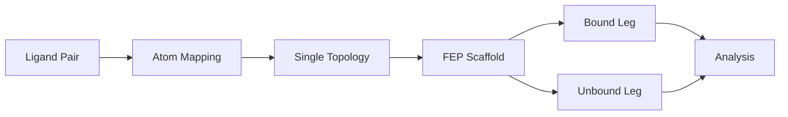
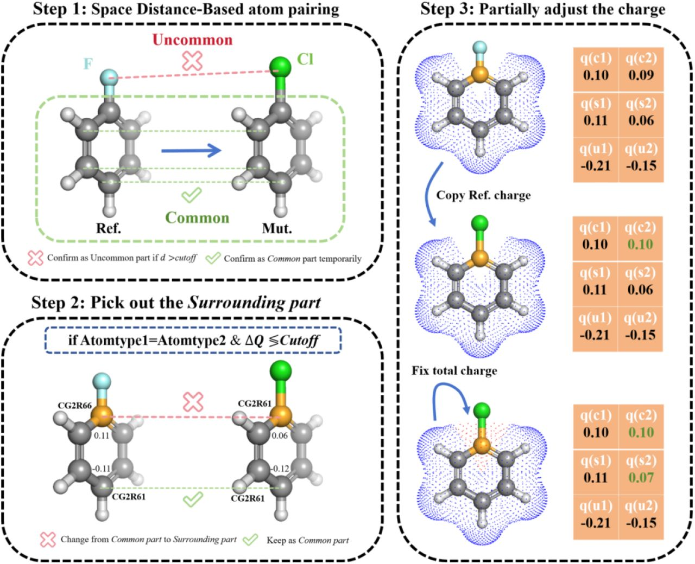
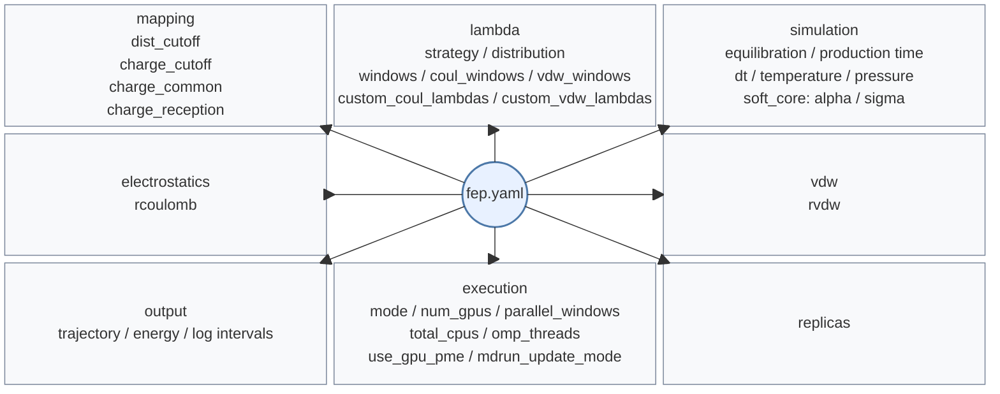

# FEP Calculations

PRISM automates the setup, execution, and analysis of **Free Energy Perturbation (FEP)** calculations for relative binding free energies between similar ligands using GROMACS hybrid topologies.

!!! example "Quick Start"
    ```bash
    prism protein.pdb ligand_ref.mol2 -o fep_output \
      --fep \
      --mutant ligand_mut.mol2 \
      --ligand-forcefield gaff2 \
      --forcefield amber14sb_OL15 \
      --fep-config fep.yaml
    ```

    This command builds the FEP scaffold. The actual MD workflow is usually started afterwards from the generated FEP directory with `run_fep.sh all`.

If you want the full YAML parameter reference, jump directly to [FEP YAML Reference](#fep-yaml-reference).

For a step-by-step worked example, see the [FEP Tutorial](../tutorials/fep-tutorial.md).

## Recommended First Run

For most users, the shortest reliable path is:

1. prepare a receptor plus a reference/mutant ligand pair and a minimal `fep.yaml`
2. generate the scaffold with `prism ... --fep --fep-config fep.yaml`
3. run `run_fep.sh all` from the generated FEP directory
4. inspect `common/hybrid/mapping.html` to confirm the perturbation is chemically sensible
5. run `prism --fep-analyze` on the completed `bound` and `unbound` legs to validate the numerical result

The rest of this page explains what PRISM generates, which defaults it uses, and which advanced options you may want to change later.

### Practical reminders

- inspect `common/hybrid/mapping.html` before committing to long production runs
- keep the default lambda schedule unless you have a concrete reason to reshape it
- prefer analyzing all matching `repeat*` pairs together rather than a single repeat when resources allow

## Overview

PRISM's FEP workflow consists of five stages:



1. **Atom Mapping**: distance-based matching between the reference and mutant ligands
2. **Single Topology**: one ligand topology with A/B-state parameters
3. **FEP Scaffold**: the complete, ready-to-run setup (hybrid topology, bound/unbound legs, MDPs, and scripts)
4. **Lambda Windows**: per-window equilibration and production inputs
5. **Analysis**: BAR, MBAR, and TI estimators over the window data

## Mapping and Single Topology

**Note**: PRISM implements the GROMACS *single topology* approach. The `hybrid.itp` file stores both state A and state B parameters in a single molecule description.

### Atom Classes

PRISM classifies atoms as:

- **Common atoms**: shared between both ligands
- **Transformed atoms**: only present in state A or only in state B; these are turned into dummy atoms (decoupled) in the state where they don't exist
- **Surrounding atoms**: retained in the single topology representation and handled with state-specific parameters from state A or state B (no dummy treatment)

### Distance-Based Atom Mapping

PRISM identifies common atoms using geometry and element identity and surrounding atoms with charge/FF-based filtering.



### Charge Redistribution

**Why charge redistribution matters**: FEP calculations measure free energy differences by alchemically transforming one ligand into another. In practice, smaller and more local perturbations usually improve phase-space overlap and make the calculation easier to converge.

When atoms are classified as **common** (shared between both ligands), keeping their electrostatic properties as consistent as possible usually reduces the magnitude of the alchemical transformation. This often leads to:

- **Better convergence** — fewer lambda windows needed for adequate overlap
- **Lower variance** — smaller statistical uncertainty in the final $\Delta G$
- **Improved physical realism** — common regions should behave consistently in both states

PRISM implements this through two complementary mechanisms:

1. **`charge_common`**: Controls how shared atoms inherit charge information
2. **`charge_reception`**: When atoms transform, PRISM redistributes the compensating charge so that the end states remain consistent with the initial total charge

| Parameter | Default | Meaning |
|---|---:|---|
| `dist_cutoff` | `0.6 nm` | Distance cutoff for candidate atom matches. |
| `charge_cutoff` | `0.05` | Charge-difference filter used during mapping/classification. |
| `charge_common` | `mean` | Default shared-atom charge strategy. |
| `charge_reception` | `surround` | Default redistribution target for compensating charge. |

!!! note
    PRISM uses GROMACS-style length units internally. A mapping cutoff of `0.6` means **0.6 nm**, not 0.6 Å.

For detailed parameter descriptions, charge options, and allowed redistribution modes, see the [`mapping` section](#mapping-section) below.

For the current GROMACS discussion of free-energy pathways, end states, and interaction handling, see the GROMACS free-energy references.[^gmx-free-energy-impl] [^gmx-free-energy-interactions]

### GROMACS-Compatible Single Topology

The generated `hybrid.itp` stores both state A and state B parameters in a single molecule description. In GROMACS this means the **end states** are encoded in the topology, while the **path** between them is controlled by the lambda schedule in the generated MDP files.

For the current GROMACS description of free-energy end states, lambda vectors, and interaction handling, see the GROMACS free-energy references.[^gmx-free-energy-impl] [^gmx-free-energy-interactions] The `gmx grompp` manual also documents `-rb` for B-state reference coordinates.[^gmx-grompp]

## Lambda Schedules

For most ligand series, start with the default `decoupled` + `nonlinear` schedule. Only change this section if you have a specific reason to tune window placement or coupling order. The exact keys and defaults are listed in the [`lambda` section](#lambda-section) of the FEP YAML Reference.

PRISM-generated MDPs write separate lambda vectors for:

| Lambda vector | Role |
|---|---|
| `coul-lambdas` | Controls electrostatic transformation. |
| `vdw-lambdas` | Controls van der Waals transformation. |
| `bonded-lambdas` | Controls bonded-term interpolation. |
| `mass-lambdas` | Controls mass interpolation. |

This means the implementation is more specific than a single scalar lambda applied uniformly to all interaction terms.

### Supported schedule modes

| Mode | Default? | Meaning |
|---|---|---|
| `decoupled` | yes | Coulomb transforms first, then VDW transforms. |
| `coupled` | no | Coulomb and VDW follow the same schedule together from 0 to 1. |
| `custom` | no | User supplies explicit `custom_coul_lambdas` and `custom_vdw_lambdas`. Shorter arrays are padded with their final value. |

The following figure visualizes the three lambda schedule modes:

<p align="center">
  
</p>

#### Figure explanation

- `Decoupled` (default): a two-stage path where Coulomb (red) completes first (windows 0-11), followed by VDW (blue) (windows 12-31). Bonded (gray dashed) and mass (green dotted) follow the Coulomb schedule.
- `Coupled`: Coulomb and VDW change together across all 32 windows and therefore share the same lambda progression.
- `Custom`: user-supplied arrays can place Coulomb and VDW transitions at different points; the example here shows an earlier Coulomb jump and a later VDW transition.

### Supported distributions

The following figure compares the three supported point distributions using 32 lambda points:

<p align="center">
  
</p>

| Distribution | Default? | Meaning |
|---|---|---|
| `linear` | no | Uniform spacing, i.e. `linspace(0, 1, n_points)`. |
| `nonlinear` | yes | PRISM's empirical endpoint-dense reference schedule: a fixed 32-point table, subsampled for fewer points and interpolated for more points. |
| `quadratic` | no | An empirical symmetric power-law family with tunable endpoint bias; use it when you want more or fewer points near $\lambda=0$ and $\lambda=1$ without writing explicit custom arrays. |

For the `quadratic` family, PRISM uses the empirical symmetric piecewise definition

$$
\lambda(x)=
\begin{cases}
\dfrac{1}{2}(2x)^p, & x \le 0.5 \\
1 - \dfrac{1}{2}\left(2(1-x)\right)^p, & x > 0.5
\end{cases}
$$

where $p$ is the `quadratic_exponent`. This is an empirical schedule-shaping parameter rather than a theoretically unique optimum. The historical behavior corresponds to `quadratic_exponent: 2.0`; larger values make the endpoints denser and the middle sparser. If you need exact placement, use `custom_coul_lambdas` and `custom_vdw_lambdas` instead. The figure above overlays both the default `p=2` curve and a stronger `p=4` example.

Current GROMACS references for lambda schedules and interaction-specific lambda control are the GROMACS free-energy chapters.[^gmx-free-energy-impl] [^gmx-free-energy-interactions]

## Build Workflow

### Build the Scaffold

```bash
prism protein.pdb ligand_ref.mol2 -o fep_output \
  --fep \
  --mutant ligand_mut.mol2 \
  --ligand-forcefield gaff2 \
  --forcefield amber14sb_OL15 \
  --fep-config fep.yaml
```

PRISM then:

1. **maps the ligand pair and writes the mapping report** - PRISM aligns the reference and mutant ligands, classifies atoms as common / transformed / surrounding, and writes `common/hybrid/mapping.html`. This is the first model-quality checkpoint, before any MD is run.
2. **builds the hybrid ligand files** - PRISM writes the hybrid topology (`hybrid.itp`), coordinates (`hybrid.gro`), and supporting includes in `common/hybrid/`. These files define the A/B-state ligand used in both legs.
3. **prepares the bound leg** - PRISM inserts the hybrid ligand into the protein system, then writes the leg-specific input structure, topology, MDP files, and execution scripts needed for EM, NVT, NPT, and production windows.
4. **prepares the unbound leg** - PRISM builds the solvated hybrid-ligand system and reuses the bound-leg box vectors so the two legs start from the same box dimensions.

### Generated Execution Scripts and Configuration

PRISM then generates the execution environment for both legs:

1. **writes per-leg production helper scripts** - `run_prod_standard.sh` and `run_prod_repex.sh` are leg-level helpers. They are normally called by `run_fep.sh`, rather than used as the primary user entry point.
2. **writes a root-level `run_fep.sh`** - this is the main entry point most users run. It acts as both a target dispatcher and a full workflow runner: it executes leg-level EM/NVT/NPT first, then dispatches production through either `run_prod_standard.sh` or `run_prod_repex.sh` according to `execution.mode`. You can include this in your slurm script.
3. **writes per-window MDPs** - PRISM generates lambda-specific `em_short`, `npt_short`, and `prod` MDPs so each window receives its own short relaxation before production.
4. **writes `fep_scaffold.json`** - a scaffold manifest that records the generated layout and key metadata. It is useful if you need to inspect or troubleshoot the scaffold.

### Execution Workflow

For each leg, PRISM prepares the following execution stages:

1. **leg-level equilibration** - EM, NVT, NPT stages for the initial structure each leg
2. **per-window relaxation** - each lambda window receives its own short lambda-specific relaxation (`em_short`, `npt_short`) before production
3. **production execution** - final production runs (`prod`) for each lambda window

This means each lambda window is not launched directly from the leg-level NPT state; it first receives its own short lambda-specific relaxation.

This workflow is designed to make the scaffold easier to run and restart from a breakpoint.

### Generated MDP Behavior

The generated per-window MDPs include:

| MDP item | Current behavior |
|---|---|
| `init-lambda-state` | Set to the current window index.[^gmx-mdp-init-lambda-state] |
| `calc-lambda-neighbors` | `-1` in window-level equilibration and production templates.[^gmx-mdp-calc-lambda-neighbors] |
| Lambda vectors | Explicit `coul-lambdas`, `vdw-lambdas`, `bonded-lambdas`, and `mass-lambdas` are written. |
| Soft-core settings | `sc-alpha` and `sc-sigma` are included in the generated templates. |

For the current GROMACS description of these free-energy controls, see the `.mdp` options and free-energy references listed at the end of this page.[^gmx-current]

### Production Execution Modes

`run_fep.sh` chooses the production helper according to `execution.mode` after leg-level EM, NVT, and NPT finish. In other words, the mode controls the production-stage backend, not the earlier leg-level equilibration stages.

| Mode | What PRISM does | When to use it |
|---|---|---|
| `standard` | Calls `run_prod_standard.sh`, which performs per-window lambda-specific relaxation (`em_short`, `npt_short`) and then launches each window independently. `parallel_windows` controls how many windows run at once, and GPUs are assigned round-robin across active windows. | The default choice for straightforward throughput-oriented runs. |
| `repex` | Calls `run_prod_repex.sh`, which prepares the same per-window prerequisites and then launches lambda replica exchange with `gmx_mpi -multidir`. | Use when you want exchange between neighboring lambda states instead of fully independent windows. |

## Running FEP

The generated `run_fep.sh` script accepts one or more **targets**. If you call it with no arguments, it defaults to `all`.

In normal use, `run_fep.sh` is the script you run directly. The per-leg helper scripts (`run_prod_standard.sh` and `run_prod_repex.sh`) exist so that `run_fep.sh` can dispatch the correct production backend after leg-level equilibration has completed.

```bash
cd fep_output/GMX_PROLIG_FEP

bash run_fep.sh bound
bash run_fep.sh unbound
bash run_fep.sh all
```

### Target forms

| Target form | Meaning |
|---|---|
| `bound` | Run the bound leg. If multiple replicas exist, this expands to all bound replicas. |
| `unbound` | Run the unbound leg. If multiple replicas exist, this expands to all unbound replicas. |
| `all` | Run all configured bound and unbound legs or replicas. |
| `bound1` / `unbound2` | Run one specific replica. |
| `bound1-3` | Run a replica range for one leg. |
| `bound1 unbound3` | Run multiple explicit targets in one command. |

Examples:

```bash
bash run_fep.sh bound1
bash run_fep.sh unbound2
bash run_fep.sh bound1-3
bash run_fep.sh bound1 unbound1
```

### Runtime environment variables

The following overrides are mainly useful when you need to adapt the generated scripts to the resources available on a specific machine.

!!! note
    `PRISM_NUM_GPUS`, `PRISM_PARALLEL_WINDOWS`, `PRISM_OMP_THREADS`, and `PRISM_TOTAL_CPUS` affect the generated run scripts only. They do not change the scaffold, topology, or lambda schedule.

| Variable | Meaning |
|---|---|
| `PRISM_FEP_MODE` | Overrides `execution.mode` at runtime (`standard` or `repex`). |
| `PRISM_NUM_GPUS` | Overrides the production GPU pool size used by `run_prod_standard.sh` or `run_prod_repex.sh`. |
| `PRISM_PARALLEL_WINDOWS` | Overrides the number of concurrent windows in `standard` mode. |
| `PRISM_OMP_THREADS` | Explicitly sets the OpenMP thread count used by the generated scripts. |
| `PRISM_TOTAL_CPUS` | Sets a total CPU budget; if `PRISM_OMP_THREADS` and `OMP_NUM_THREADS` are unset, PRISM derives threads per worker from this value. |
| `PRISM_GPU_ID` | Forces a specific physical GPU for the current `run_fep.sh` invocation during leg-level EM/NVT/NPT. Production windows still use the generated production helper scripts and their own GPU pool logic. |
| `PRISM_CPU_OFFSET` | Forces the CPU pin offset used for the current leg during leg-level EM/NVT/NPT. |
| `PRISM_MDRUN_UPDATE_MODE` | Overrides update placement for GPU runs (`gpu`, `cpu`, or `none`). |
| `OMP_NUM_THREADS` | Generic OpenMP override; PRISM uses it unless `PRISM_OMP_THREADS` is set. |

!!! note
    You can run `run_prod_standard.sh` or `run_prod_repex.sh` directly if the leg has already completed its leg-level build/EM/NVT/NPT stages, but the normal workflow is to launch `run_fep.sh` and let it handle both equilibration and production dispatch.

Typical examples:

```bash
# Force repex for this run, even if the scaffold was generated with standard mode
PRISM_FEP_MODE=repex bash run_fep.sh bound

# Limit production to two GPUs and two concurrent windows
PRISM_NUM_GPUS=2 PRISM_PARALLEL_WINDOWS=2 bash run_fep.sh bound

# Derive threads from a total CPU budget
PRISM_TOTAL_CPUS=32 PRISM_NUM_GPUS=4 bash run_fep.sh all

# Pin leg-level equilibration to one specific GPU
PRISM_GPU_ID=2 bash run_fep.sh unbound
```

## Analysis

PRISM FEP produces **two different HTML reports** at different stages of the workflow, and they should be read separately.

### Mapping Report (pre-MD quality check)

PRISM writes `common/hybrid/mapping.html` during scaffold construction, before any MD is launched.

!!! note
    Treat `common/hybrid/mapping.html` as the first checkpoint before running MD. If the mapped common core or transformed region looks chemically wrong, fix the scaffold first rather than continuing to production.

Use this report to inspect:

- atom correspondence between the reference and mutant ligands
- common / transformed / surrounding classifications
- charge patterns and atom labels
- whether the hybridization result looks chemically local and sensible

The report contains:

- a display toolbar that lets you switch between **FEP Classification** and **Element** coloring, toggle **charges** and **atom labels**, reset the view, export a PNG snapshot, jump to the atom-details section, or print the page
- a legend that reports both the **classification counts** (`Common`, `Transformed A/B`, `Surrounding A/B`) and the **element color key** used in the alternate coloring mode
- two independently pannable and zoomable ligand views for side-by-side inspection
- hover tooltips that show the atom name, element, charge, classification, and the mapped partner atom in the opposite ligand
- an atom-details section with summary counts and a paired table listing atom names, element types, atom types, charges, and classifications for both ligands

<p align="center">
  
</p>

*Example mapping report generated during scaffold construction.*

A quick checklist for `mapping.html`:

- the common core should match your chemical intuition for the shared scaffold
- the transformed region should be localized to the actual mutation site
- surrounding atoms should look like a narrow boundary region, not most of the ligand
- if these classes look implausible, revisit the mapping parameters before launching MD

### Numerical Analysis Report (post-MD validation)

After production has generated `dhdl.xvg` files for the windows, run `prism --fep-analyze` to build the numerical free-energy report.

```bash
prism --fep-analyze \
  --bound-dir fep_output/GMX_PROLIG_FEP/bound \
  --unbound-dir fep_output/GMX_PROLIG_FEP/unbound \
  --estimator MBAR BAR TI \
  --bootstrap-n-jobs 8 \
  --output fep_results.html \
  --json fep_results.json
```

#### Command-Line Parameters

| Parameter | Type | Default | Description |
|---|---|---|---|
| **Required Arguments** |
| `--bound-dir` | PATH | - | Bound leg directory (repeat dir or leg dir with repeat* subdirs) |
| `--unbound-dir` | PATH | - | Unbound leg directory (repeat dir or leg dir with repeat* subdirs) |
| **Output Options** |
| `--output`, `-o` | FILE | `fep_analysis_report.html` | Output HTML report file |
| `--json` | FILE | - | Also save results to JSON file (optional) |
| **Analysis Options** |
| `--estimator`, `-e` | LIST | `MBAR` | Free energy estimator(s): TI, BAR, MBAR (multiple allowed) |
| `--all-estimators` | flag | - | Run all estimators (TI, BAR, MBAR) with comparison report |
| `--backend` | CHOICE | `alchemlyb` | Analysis backend: `alchemlyb` (TI/BAR/MBAR) or `gmx_bar` (BAR only) |
| `--temperature` | FLOAT | `310.0` | Simulation temperature in Kelvin |
| `--components` | LIST | `elec vdw` | Energy components to analyze |
| `--bootstrap-n-jobs` | INT | `1` | Parallel workers for bootstrap analysis (1 = serial) |
| `--no-progress` | flag | - | Disable progress bars (useful for logging) |

!!! note
    The recommended input form is to pass the leg directories themselves (`.../bound` and `.../unbound`). PRISM then auto-discovers all `repeat*` subdirectories under each leg and performs aggregated analysis across them. The CLI also checks that the number of bound and unbound repeats matches before analysis starts. You can still pass a single repeat directory (`bound/repeat1`, `unbound/repeat1`) if you explicitly want to analyze only one repeat.

PRISM supports three standard estimators:

| Estimator | Full Name | Description | Use Case |
|---|---|---|---|
| **TI** | Thermodynamic Integration | Numerical integration of $\partial H / \partial \lambda$ across windows | Good for smooth transformations with well-sampled gradients |
| **BAR** | Bennett Acceptance Ratio | Optimal overlap between neighboring windows | Robust for standard FEP with adequate sampling |
| **MBAR** | Multistate BAR | Uses all data simultaneously with reweighting | Most efficient; provides overlap matrix for quality control |

The analysis workflow is:

1. read `dhdl.xvg` files from each `window_*` directory
2. compute $\Delta G$ for the bound leg and the unbound leg
3. report binding free energy as $\Delta G_{\mathrm{bind}} = \Delta G_{\mathrm{unbound}} - \Delta G_{\mathrm{bound}}$
4. estimate uncertainty by bootstrap resampling when requested
5. generate an HTML report

The generated HTML file is often named `fep_results.html`, `fep_analysis_report.html`, or `fep_multi_estimator_report.html`, depending on your command and output naming.

Use the numerical report to inspect:

- $\Delta G$ and $\Delta\Delta G$ summary values
- overlap matrices between neighboring windows when you analyze with **MBAR**
- convergence behavior over time
- repeat statistics when multiple repeats are analyzed together
- agreement or disagreement between TI, BAR, and MBAR when you request multiple estimators

Not every report shows every panel. In particular, the overlap matrix is MBAR-only, repeat summaries appear only when multiple repeats are aggregated, and estimator comparison is most useful when you request more than one estimator.

How to read the main analysis panels:

| Panel | When it appears | What it is for | What usually looks healthy | What is concerning |
|---|---|---|---|---|
| Repeat summary | When multiple repeats are analyzed together. | Compares replicate legs or aggregated repeat statistics. | Repeats tell a similar story and no single repeat is an obvious outlier. | One repeat dominates the average or repeats disagree more than their uncertainties suggest. |
| Estimator summary | When you request multiple estimators, such as TI + BAR + MBAR. | Compares different estimators on the same dataset. | TI/BAR/MBAR are broadly consistent within uncertainty. | One estimator strongly disagrees with the others or only one estimator appears stable. |
| Overlap matrix | MBAR analyses only. | Shows whether neighboring lambda windows sample sufficiently similar states for reweighting. | Strongest values cluster near the diagonal and neighboring windows show visible overlap. | Very weak neighboring overlap, isolated windows, or obvious gaps between adjacent states. |
| Convergence plots | Whenever time-convergence analysis succeeds. | Show how the estimated free energy changes as more trajectory data are included. | Curves flatten with time and late-time estimates stay close to each other. | Large late-time drift, strong oscillation, or different trajectory fractions giving very different answers. |
| Uncertainty / bootstrap | When bootstrap resampling is enabled and produces usable samples. | Quantifies statistical uncertainty from resampling. | Error bars are small enough for the decision you want to make and are compatible with repeat-to-repeat variation. | Very large intervals, unstable bootstrap behavior, or uncertainty that is comparable to the reported signal. |

<p align="center">
  
</p>

*Example numerical FEP analysis report generated after production and post-processing.*

!!! warning
    Do not interpret a reported free-energy value without checking overlap, convergence, and estimator agreement in the numerical report.

## FEP YAML Reference

If you started from the workflow sections above and now want the exact configuration keys, use the following reference. This section is intentionally more detailed than the workflow overview: it combines core options that many users may touch with advanced or implementation-level notes that are useful when you need tighter control.

### Configuration Map



Text fallback for the same structure:

```text
fep.yaml
|- mapping
|- lambda
|- simulation
|- electrostatics
|- vdw
|- output
|- execution
|- replicas
```

### Example `fep.yaml`

```yaml
mapping:
  dist_cutoff: 0.6
  charge_cutoff: 0.05
  charge_common: mean
  charge_reception: surround

lambda:
  strategy: decoupled
  distribution: nonlinear
  quadratic_exponent: 2.0
  windows: 32
  coul_windows: 12
  vdw_windows: 20
  # custom_coul_lambdas: [0.0, 0.2, 0.5, 1.0]
  # custom_vdw_lambdas: [0.0, 0.0, 0.5, 1.0]

simulation:
  equilibration_nvt_time_ps: 500
  equilibration_npt_time_ps: 500
  per_window_npt_time_ps: 100
  production_time_ns: 2.0
  dt: 0.002
  temperature: 310
  pressure: 1.0

soft_core:
  alpha: 0.5
  sigma: 0.3

electrostatics:
  rcoulomb: 1.0

vdw:
  rvdw: 1.0

output:
  trajectory_interval_ps: 500
  energy_interval_ps: 10
  log_interval_ps: 10
  nstdhdl: 100

execution:
  mode: standard
  num_gpus: 4
  parallel_windows: 4
  total_cpus: 56
  omp_threads: 14
  use_gpu_pme: true
  mdrun_update_mode: auto

replicas: 3
```

### `mapping` section

#### `charge_common` modes

| Mode | Meaning |
|---|---|
| `ref` | Keep the reference ligand (state A) charge on common atoms. Works when optimizing a lead compound. |
| `mut` | Use the mutant ligand (state B) charge on common atoms. |
| `mean` | Average the A/B charges on common atoms. This is the default because it usually reduces the electrostatic perturbation. |
| `none` | Keep original per-state charges, skip common-atom averaging/redistribution, and let charge-mismatched candidate common atoms fall back to the surrounding class. |

#### `charge_cutoff`

`charge_cutoff` is applied after geometric matching, during the common-versus-surrounding decision. If two atoms are geometrically compatible but their charge difference is larger than the cutoff, PRISM does **not** keep them in the clean common set; it reclassifies that matched pair as `surrounding_a` / `surrounding_b`. In other words, they remain position-matched, but they are treated as a perturbed local environment rather than a charge-consistent common core.

#### Charge redistribution modes

PRISM documents the following `charge_reception` modes for the standard workflow:

| Mode | Default? | Meaning |
|---|---|---|
| `surround` | yes | Redistribute onto atoms surrounding the transformed region. |
| `unique` | no | Redistribute only onto atoms unique to the transformed region. |
| `none` | no | Disable redistribution after common-atom assignment. In practice this is safest when paired with `charge_common: none`; otherwise the end-state total charges may no longer match the original ligands. |

These are the standard user-facing modes exposed by the PRISM FEP workflow. The older FEbuilder CLI used `surround_ext` as a third redistribution mode, but PRISM’s standard distance-based mapping path documents `surround`, `unique`, and `none` for normal use.

!!! warning
    Treat `charge_reception: none` as a special-case setting. It pairs naturally with `charge_common: none`. If you mix `charge_reception: none` with `charge_common: ref`, `mut`, or `mean`, PRISM will still modify common-atom charges but will not redistribute the resulting charge difference, so the end-state total charges can drift away from the original ligands.

### `lambda` section

| Key | Default | Meaning |
|---|---:|---|
| `strategy` | `decoupled` | Lambda scheduling mode: `decoupled`, `coupled`, or `custom`. |
| `distribution` | `nonlinear` | Distribution along the schedule: `linear`, `nonlinear`, or `quadratic`. |
| `quadratic_exponent` | `2.0` | Empirical endpoint-bias exponent used when `distribution: quadratic`; larger values give denser endpoints, while `custom_*_lambdas` remains the most explicit option. |
| `windows` | `32` | Total window count for `coupled`, and target total for `decoupled`. |
| `coul_windows` | `12` | Coulomb-stage window count in `decoupled` mode. |
| `vdw_windows` | `20` | VDW-stage window count in `decoupled` mode. |
| `custom_coul_lambdas` | none | Required for `custom`; YAML float list such as `[0.0, 0.2, 0.5, 1.0]` for the Coulomb schedule. See [Example `fep.yaml`](#example-fepyaml). |
| `custom_vdw_lambdas` | none | Required for `custom`; YAML float list such as `[0.0, 0.0, 0.5, 1.0]` for the VDW schedule. See [Example `fep.yaml`](#example-fepyaml). |

If you use only the top-level CLI flag `--lambda-windows`, treat it as a simple convenience override. For reproducible FEP work, prefer an explicit YAML lambda section.

Reference: see the current GROMACS free-energy references listed at the end of this page.

### `simulation` section

| Key | Default | Meaning |
|---|---:|---|
| `equilibration_nvt_time_ps` | `500` | Leg-level NVT equilibration time in ps. |
| `equilibration_npt_time_ps` | `500` | Leg-level NPT equilibration time in ps. |
| `per_window_npt_time_ps` | `100` | Per-window short NPT equilibration time in ps before production. |
| `production_time_ns` | `2.0` | Production length per lambda window in ns. |
| `dt` | `0.002` | MD time step in ps. |
| `temperature` | `310` | Simulation temperature in K. |
| `pressure` | `1.0` | Simulation pressure in bar. |

These are FEP-facing controls. The first two settings govern leg-level equilibration, `per_window_npt_time_ps` governs the short per-window relaxation before each production window, and `production_time_ns` sets the production length of each lambda window.

### `soft_core` section

| Key | Default | Meaning |
|---|---:|---|
| `alpha` | `0.5` | Soft-core alpha parameter for alchemical nonbonded interactions. |
| `sigma` | `0.3` | Soft-core sigma parameter in nm. |

This section is FEP-specific and directly controls the alchemical soft-core treatment in the generated window MDPs. In GROMACS, these correspond to the `sc-alpha` and `sc-sigma` `.mdp` options, while the broader physical discussion of soft-core behavior appears in the free-energy interaction reference (including `sc-coul`).[^gmx-mdp-options] [^gmx-mdp-sc-alpha] [^gmx-mdp-sc-sigma] [^gmx-free-energy-interactions]

### Nonbonded settings (`electrostatics` + `vdw`)

These settings are not unique to FEP. They are PRISM/GROMACS-style nonbonded controls that the FEP scaffold reuses when writing the window-specific MDP files.

| Section | Key | Default | Meaning |
|---|---|---:|---|
| `electrostatics` | `rcoulomb` | `1.0` | Requested Coulomb cutoff in nm. |
| `vdw` | `rvdw` | `1.0` | Requested van der Waals cutoff in nm. |

The generated FEP templates use the configured `rcoulomb` and `rvdw` values directly (default `1.0 nm`).

### Output controls (`output` section)

Like the nonbonded settings above, these are general MD output controls that PRISM also reuses for FEP scaffolds.

| Key | Default | Meaning |
|---|---:|---|
| `trajectory_interval_ps` | `500` | Trajectory output interval in ps. |
| `energy_interval_ps` | `10` | Energy output interval in ps. |
| `log_interval_ps` | `10` | Log output interval in ps. |
| `nstdhdl` | `100` | Interval in MD steps for writing free-energy derivatives and Hamiltonian differences to `dhdl.xvg`. |

`trajectory_interval_ps`, `energy_interval_ps`, and `log_interval_ps` follow the same broad semantics as other PRISM MD workflows. `nstdhdl` is the FEP-specific addition in this section: PRISM passes it through to the generated window MDPs so you can control how often `dhdl.xvg` is written.

PRISM currently keeps `separate-dhdl-file = yes`, so each production window writes a dedicated `dhdl.xvg` file for downstream analysis instead of storing those derivatives only inside `ener.edr`.[^gmx-mdp-options] [^gmx-mdp-nstdhdl] [^gmx-mdp-separate-dhdl-file]

### `execution` section

| Key | Default | Meaning |
|---|---:|---|
| `mode` | `standard` | Production execution mode: `standard` or `repex`. |
| `num_gpus` | `null` | Total GPUs available to generated scripts. |
| `parallel_windows` | `null` | Concurrent windows in `standard` mode; if omitted, scripts fall back to GPU count. |
| `total_cpus` | `null` | Total CPUs available; used to derive OpenMP threads when `omp_threads` is not set. |
| `omp_threads` | `null` | Manual OpenMP thread override per worker/rank. |
| `use_gpu_pme` | `true` | Whether production helpers request `-pme gpu`. |
| `mdrun_update_mode` | `auto` | Runtime update mode: `auto`, `gpu`, `cpu`, or `none`. |
| `use_gpu_update` | `false` | Legacy compatibility switch; current FEP defaults keep GPU-side update off unless explicitly enabled. |

### Top-level key

| Key | Default | Meaning |
|---|---:|---|
| `replicas` | `3` | Number of bound/unbound repeat directories to scaffold. |

## Troubleshooting

### Mapping looks chemically wrong

- verify protonation and tautomer states first
- prefer MOL2 or SDF when PDB loses bond-order information
- inspect `common/hybrid/mapping.html` before trusting a scaffold

### Windows fail early

- inspect leg-level `build/em.log`, `build/nvt.log`, and `build/npt.log`
- inspect the hybrid files in `common/hybrid/`
- rerun a short validation run before launching long production if you have changed the scaffold or runtime settings substantially

### Analysis finds no windows

- pass the leg directories (`.../bound` and `.../unbound`) unless you intentionally want to analyze only one repeat
- if you pass leg directories, PRISM expects the number of `repeat*` subdirectories under `bound` and `unbound` to match
- confirm that each `window_*` directory contains production outputs such as `prod.*` and `dhdl.xvg`

### Practical Notes

- Prefer an explicit `fep.yaml` for reproducible lambda schedules.
- When resources allow, analyze multiple `repeat*` pairs together instead of relying on a single repeat.
- The CLI still exposes `--lambda-windows`, but it is a simplified override. If you care about exact schedules, define the lambda section explicitly in YAML.
- `execution.mode`, `parallel_windows`, `num_gpus`, `total_cpus`, and `omp_threads` only affect generated run scripts; they do not change the topology or lambda schedule.
- If you use `custom` lambda schedules, validate the arrays carefully before large production campaigns.
- In `standard` mode, generated scripts assign GPUs round-robin across windows and use `-pinoffset` to separate CPU blocks between GPU workers.
- If `execution.total_cpus` is set, PRISM derives `omp_threads` from the available CPU budget; `execution.omp_threads` acts as a manual override.
- GPU PME is enabled by default in generated production helpers, but GPU-side update is not enabled by default because FEP mass-perturbation workflows are not generally compatible with `-update gpu`.
- With CUDA builds of **GROMACS 2026.0+**, perturbed non-bonded free-energy kernels can also run on the GPU, so PRISM's default GPU production path may benefit automatically from newer GROMACS releases even while `use_gpu_update` remains disabled by default.

## References

[^gmx-free-energy-impl]: [GROMACS current reference manual, *Free energy implementation*](https://manual.gromacs.org/current/reference-manual/special/free-energy-implementation.html).
[^gmx-free-energy-interactions]: [GROMACS current reference manual, *Free-energy interactions*](https://manual.gromacs.org/current/reference-manual/functions/free-energy-interactions.html).
[^gmx-grompp]: [GROMACS current online help, `gmx grompp`](https://manual.gromacs.org/current/onlinehelp/gmx-grompp.html).
[^gmx-mdp-init-lambda-state]: [GROMACS `.mdp` option: `init-lambda-state`](https://manual.gromacs.org/current/user-guide/mdp-options.html#mdp-init-lambda-state).
[^gmx-mdp-calc-lambda-neighbors]: [GROMACS `.mdp` option: `calc-lambda-neighbors`](https://manual.gromacs.org/current/user-guide/mdp-options.html#mdp-calc-lambda-neighbors).
[^gmx-current]: [GROMACS current manual](https://manual.gromacs.org/current/).
[^gmx-mdp-options]: [GROMACS current manual, *Molecular dynamics parameters (.mdp options)*](https://manual.gromacs.org/current/user-guide/mdp-options.html).
[^gmx-mdp-sc-alpha]: [GROMACS `.mdp` option: `sc-alpha`](https://manual.gromacs.org/current/user-guide/mdp-options.html#mdp-sc-alpha).
[^gmx-mdp-sc-sigma]: [GROMACS `.mdp` option: `sc-sigma`](https://manual.gromacs.org/current/user-guide/mdp-options.html#mdp-sc-sigma).
[^gmx-mdp-nstdhdl]: [GROMACS `.mdp` option: `nstdhdl`](https://manual.gromacs.org/current/user-guide/mdp-options.html#mdp-nstdhdl).
[^gmx-mdp-separate-dhdl-file]: [GROMACS `.mdp` option: `separate-dhdl-file`](https://manual.gromacs.org/current/user-guide/mdp-options.html#mdp-separate-dhdl-file).
[^gmx-2026-1-release-notes]: [GROMACS 2026.1 release notes: fixes for perturbed non-bonded interactions on GPU](https://manual.gromacs.org/current/release-notes/2026/2026.1.html).

## See Also

- [FEP Tutorial](../tutorials/fep-tutorial.md) — a step-by-step worked example that walks through scaffold generation, production setup, and analysis.
- [Analysis Tools](analysis-tools.md) — command-line and report-oriented guidance for inspecting trajectories, energies, convergence, and related post-processing outputs.
- [Configuration](configuration.md) — the broader PRISM configuration reference beyond the FEP-specific `fep.yaml` options documented here.
