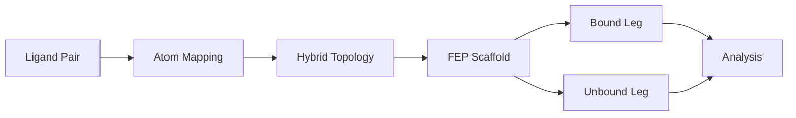

# FEP Calculations

PRISM automates **Free Energy Perturbation (FEP)** calculations for estimating relative binding free energies between similar ligands using alchemical transformations with GROMACS.

!!! example "Quick Start"
    ```bash
    # Basic FEP calculation with default settings
    prism protein.pdb ligand_ref.mol2 -o fep_output \
      --fep \
      --mutant ligand_mut.mol2 \
      --ligand-forcefield gaff2 \
      --fep-config fep.yaml
    ```

## Overview

!!! info "What is FEP?"
    Free Energy Perturbation (FEP) is a rigorous alchemical method for calculating relative binding free energies between similar ligands. PRISM implements a complete FEP workflow with automated atom mapping, hybrid topology construction, lambda window setup, and multi-estimator analysis.

The PRISM FEP workflow consists of four stages:



1. **Atom Mapping**: Distance-based mapping between reference and mutant ligands
2. **Hybrid Topology**: Single-topology representation with A/B-state encoding
3. **FEP Scaffold**: Complete system setup for bound and unbound legs
4. **Lambda Windows**: Alchemical transformation across multiple λ states
5. **Analysis**: Multi-estimator (BAR/MBAR/TI) with bootstrap uncertainty

## Theory

### Distance-Based Atom Mapping

PRISM uses a systematic distance-based approach for atom mapping between ligands. For two ligands with $N_A$ and $N_B$ atoms, atoms are matched based on:

$$
d_{ij} = \| \mathbf{r}_i^{(A)} - \mathbf{r}_j^{(B)} \|
$$

where $\mathbf{r}_i^{(A)}$ and $\mathbf{r}_j^{(B)}$ are atomic positions. Atoms are matched if:

$$
d_{ij} < d_{\text{cutoff}} \quad \text{and} \quad |q_i^{(A)} - q_j^{(B)}| < q_{\text{cutoff}}
$$

**Default cutoffs**: $d_{\text{cutoff}} = 0.6$ Å, $q_{\text{cutoff}} = 0.05$ e

### Atom Classification

Atoms are classified into three categories:

- **Common atoms**: Present in both ligands with same position/charge
- **Transformed atoms**: Present in only one ligand (A-only or B-only)
- **Surrounding atoms**: Near the mutation site but not directly involved

### Single-Topology Hybrid System

PRISM uses a single-topology approach where the hybrid ligand contains both reference (A) and mutant (B) states in one ITP file:

```
[ atoms ]
;   nr       type  resnr residue  atom   cgnr    charge       mass   typeB    chargeB    massB
   1        ca      1    LIG       CA     1     -0.120    12.011    ca      -0.120    12.011   ; Common
   2        ha      1    LIG       HA     1      0.150     1.008    ha       0.150     1.008   ; Common
   3        c       1    LIG       C1     1     -0.115    12.011    c       -0.115    12.011   ; A-only (disappears)
   4        hc      1    LIG       H1     1      0.150     1.008   dummy      0.000    12.011   ; Transformed A
   5     dummy      1    LIG       C2     1      0.000    12.011     c        0.180    12.011   ; Transformed B
   6     dummy      1    LIG       H2     1      0.000     1.008    hc       0.150     1.008   ; B-only (appears)
```

The Hamiltonian interpolates between states with coupling parameter $\lambda \in [0, 1]$:

$$
H(\lambda) = (1 - \lambda) H_A + \lambda H_B
$$

### Lambda Windows

PRISM supports multiple lambda strategies for smooth alchemical transformation:

#### Decoupled Strategy (Default)

Separate electrostatic and van der Waals transformations:

$$
\Delta G = \Delta G_{\text{coul}} + \Delta G_{\text{vdw}}
$$

- **Coulomb windows**: Pure electrostatic decoupling
- **VDW windows**: Pure van der Waals decoupling
- **Default**: 4 coulomb + 7 vdw windows (11 total)

#### Coupled Strategy

Simultaneous electrostatic and van der Waals transformation:

$$
\Delta G = \int_0^1 \left\langle \frac{\partial H}{\partial \lambda} \right\rangle_\lambda d\lambda
$$

- **Lambda distribution**: Linear, nonlinear, or custom
- **Default**: 11 windows with nonlinear spacing

### Free Energy Estimators

PRISM implements three estimators for robust free energy calculation:

#### BAR (Bennett Acceptance Ratio)

Optimal estimator for neighboring windows:

$$
\Delta F_{BAR} = -k_B T \ln \frac{\langle f(\Delta U + C) \rangle_B}{\langle f(-\Delta U + C) \rangle_A}
$$

where $f(x) = 1/(1 + e^{x/k_B T})$ and $C$ is chosen iteratively.

#### MBAR (Multistate BAR)

Uses all lambda windows simultaneously for optimal variance:

$$
\Delta F_{MBAR} = -k_B T \ln \frac{\sum_n N_n \exp(-\beta U_n(x) + f_n)}{\sum_m N_m \exp(f_m)}
$$

#### TI (Thermodynamic Integration)

Numerical integration of $\partial H/\partial \lambda$:

$$
\Delta F_{TI} = \int_0^1 \left\langle \frac{\partial H}{\partial \lambda} \right\rangle_\lambda d\lambda
$$

---

## Step-by-Step Walkthrough

### Step 1: Prepare Ligand Files

Prepare reference and mutant ligand structures:

```bash
# Reference ligand (state A)
ligand_ref.mol2  # or .pdb/.sdf

# Mutant ligand (state B)
ligand_mut.mol2  # or .pdb/.sdf
```

**Important**: Ligands should be superimposed for optimal atom mapping. PRISM will align them automatically if needed.

### Step 2: Create FEP Configuration

Create `fep.yaml` for FEP-specific parameters:

```yaml
# Atom mapping parameters
mapping:
  dist_cutoff: 0.6        # Distance cutoff (Angstroms)
  charge_cutoff: 0.05     # Charge difference cutoff
  charge_common: mean     # Charge strategy for common atoms
  charge_reception: surround

# Lambda windows
lambda:
  strategy: decoupled     # or 'coupled'
  distribution: nonlinear  # or 'linear'
  windows: 11             # Total lambda windows
  coul_windows: 4         # Coulomb windows (decoupled)
  vdw_windows: 7          # VDW windows (decoupled)

# Simulation parameters
simulation:
  temperature: 310        # Temperature (K)
  production_time_ns: 2.0 # Production per window
  dt: 0.002              # Timestep (ps)

# Execution
execution:
  mode: standard          # or 'repex' for replica exchange
  total_cpus: 56
  num_gpus: 4
  parallel_windows: 4
```

### Step 3: Build FEP System

```bash
prism protein.pdb ligand_ref.mol2 -o fep_output \
  --fep \
  --mutant ligand_mut.mol2 \
  --ligand-forcefield gaff2 \
  --forcefield amber14sb \
  --fep-config fep.yaml
```

PRISM automatically:

1. **Performs atom mapping** between reference and mutant ligands
2. **Generates hybrid topology** with A/B-state encoding
3. **Creates bound leg**: Protein-hybrid ligand complex
4. **Creates unbound leg**: Hybrid ligand in water box
5. **Sets up lambda windows**: Creates directory structure for each λ
6. **Generates MDP files**: Lambda-specific parameters
7. **Creates run scripts**: Automated execution scripts

### Step 4: Inspect Atom Mapping

Review the generated mapping HTML:

```bash
# Open mapping visualization
firefox fep_output/GMX_PROLIG_FEP/common/hybrid/mapping.html
```

**Checklist**:
- ✅ No gray atoms (all atoms classified)
- ✅ Reasonable mapping statistics
- ✅ Total charge ≈ 0 for neutral molecules
- ✅ Transformed atoms make chemical sense

### Step 5: Run FEP Simulations

```bash
cd fep_output/GMX_PROLIG_FEP

# Run bound leg (all repeats)
bash run_fep.sh bound

# Run unbound leg (all repeats)
bash run_fep.sh unbound

# Or run everything
bash run_fep.sh all
```

**Directory structure**:

```
GMX_PROLIG_FEP/
├── bound/
│   ├── repeat1/
│   │   ├── window_00/  # Lambda = 0.0 (state A)
│   │   ├── window_01/  # Lambda = 0.1
│   │   ├── ...
│   │   └── window_10/  # Lambda = 1.0 (state B)
│   ├── repeat2/
│   └── repeat3/
├── unbound/
│   └── (same structure)
└── common/
    └── hybrid/
        ├── hybrid.itp
        ├── hybrid.gro
        └── mapping.html
```

### Step 6: Analyze Results

After simulations complete, analyze with multi-estimator framework:

```bash
python -m prism.fep.analysis.cli \
  --bound fep_output/GMX_PROLIG_FEP/bound \
  --unbound fep_output/GMX_PROLIG_FEP/unbound \
  --estimator BAR MBAR TI \
  --n-bootstrap 1000 \
  --output fep_results.html
```

**Output includes**:
- **ΔG values** with confidence intervals for each estimator
- **Overlap matrix** showing sampling quality between windows
- **Convergence plots** vs simulation time
- **dhdl profiles** per lambda window
- **Quality warnings** for high uncertainty or poor overlap

---

## Options Reference

### CLI Arguments

| Flag | Description | Default |
| --- | --- | --- |
| `--fep` | Enable FEP mode | off |
| `--mutant` | Mutant ligand file (required with --fep) | None |
| `--fep-config` | FEP configuration YAML file | None |
| `--distance-cutoff` | Atom mapping distance cutoff (Å) | 0.6 |
| `--charge-strategy` | Charge strategy for common atoms (ref/mut/mean) | mean |
| `--lambda-windows` | Total number of lambda windows | 11 |
| `--lambda-distribution` | Lambda spacing (linear/nonlinear) | nonlinear |
| `--lambda-strategy` | Lambda strategy (decoupled/coupled) | decoupled |

### Configuration File Parameters

#### Mapping Parameters

```yaml
mapping:
  dist_cutoff: 0.6          # Max distance for atom matching (Å)
  charge_cutoff: 0.05       # Max charge difference for matching
  charge_common: mean       # How to assign charges to common atoms
  charge_reception: surround  # How to handle charge redistribution
```

**Charge strategy options**:
- `ref`: Use reference ligand charges
- `mut`: Use mutant ligand charges
- `mean`: Average of reference and mutant (recommended)

#### Lambda Parameters

```yaml
lambda:
  strategy: decoupled       # 'decoupled' or 'coupled'
  distribution: nonlinear   # 'linear' or 'nonlinear'
  windows: 11              # Total lambda windows
  coul_windows: 4          # Coulomb windows (decoupled only)
  vdw_windows: 7           # VDW windows (decoupled only)
```

#### Simulation Parameters

```yaml
simulation:
  temperature: 310          # Temperature (K)
  pressure: 1.0            # Pressure (bar)
  production_time_ns: 2.0   # Production time per window (ns)
  dt: 0.002                # Timestep (ps)
  equilibration_nvt_time_ps: 500   # NVT equilibration (ps)
  equilibration_npt_time_ps: 500   # NPT equilibration (ps)
```

#### Execution Parameters

```yaml
execution:
  mode: standard            # 'standard' or 'repex'
  total_cpus: 56           # Total CPU cores available
  num_gpus: 4              # Number of GPUs
  parallel_windows: 4       # Windows to run simultaneously
  use_gpu_pme: true        # Use GPU for PME calculation
```

## Multi-Force Field Support

PRISM FEP supports all major ligand force fields:

| Force Field | Ligand FF | Status | Notes |
|-------------|-----------|--------|-------|
| AMBER | GAFF/GAFF2 | ✅ | Recommended, widely validated |
| AMBER | OpenFF | ✅ | Modern force field, good coverage |
| CHARMM | CGenFF | ✅ | Requires CGenFF files |
| CHARMM | RTF | ✅ | CHARMM-GUI/MATCH parameters |
| OPLS | OPLS-AA | ✅ | Via LigParGen server |
| SwissParam | MMFF/MATCH | ✅ | Via SwissParam server |

**Example usage**:

```bash
# GAFF2 force field
prism protein.pdb lig_ref.mol2 -o output \
  --fep --mutant lig_mut.mol2 \
  --ligand-forcefield gaff2 \
  --forcefield amber14sb

# OpenFF force field
prism protein.pdb lig_ref.mol2 -o output \
  --fep --mutant lig_mut.mol2 \
  --ligand-forcefield openff \
  --forcefield amber14sb

# CGenFF force field
prism protein.pdb lig_ref.mol2 -o output \
  --fep --mutant lig_mut.mol2 \
  --ligand-forcefield cgenff \
  --forcefield-path /path/to/cgenff \
  --forcefield charmm36-jul2022

# OPLS-AA force field
prism protein.pdb lig_ref.mol2 -o output \
  --fep --mutant lig_mut.mol2 \
  --ligand-forcefield opls \
  --forcefield oplsaa
```

## Customizing FEP Calculations

### Adjusting Lambda Windows

For higher accuracy:

```yaml
lambda:
  windows: 21             # More windows
  coul_windows: 8         # More coulomb windows
  vdw_windows: 13         # More VDW windows
```

For faster calculations:

```yaml
lambda:
  windows: 7              # Fewer windows
  coul_windows: 2
  vdw_windows: 5
```

### Replica Exchange Mode

Enable lambda replica exchange for enhanced sampling:

```bash
# Build with repex mode
prism protein.pdb lig_ref.mol2 -o output \
  --fep --mutant lig_mut.mol2 \
  --ligand-forcefield gaff2 \
  --fep-config fep_repex.yaml
```

In `fep_repex.yaml`:

```yaml
execution:
  mode: repex             # Enable replica exchange
  total_cpus: 56
  num_gpus: 4
  exchange_interval: 1000 # Exchange attempts (steps)
```

### Custom Charge Assignment

Control how charges are assigned to common atoms:

```yaml
mapping:
  charge_common: ref       # Use reference charges
  # or
  charge_common: mut       # Use mutant charges
  # or
  charge_common: mean      # Average (default, recommended)
```

### Multiple Repeats

Run multiple independent repeats for statistical robustness:

```bash
# Build with 3 repeats
prism protein.pdb lig_ref.mol2 -o output \
  --fep --mutant lig_mut.mol2 \
  --ligand-forcefield gaff2 \
  --fep-config fep.yaml

# The scaffold automatically creates repeat1, repeat2, repeat3
```

## Analysis and Results

### Running Analysis

```bash
# Basic analysis with MBAR
python -m prism.fep.analysis.cli \
  --bound fep_output/GMX_PROLIG_FEP/bound \
  --unbound fep_output/GMX_PROLIG_FEP/unbound \
  --output results.html

# Multi-estimator analysis
python -m prism.fep.analysis.cli \
  --bound fep_output/GMX_PROLIG_FEP/bound \
  --unbound fep_output/GMX_PROLIG_FEP/unbound \
  --estimator BAR MBAR TI \
  --n-bootstrap 1000 \
  --n-jobs 8 \
  --output results.html

# Analysis for specific repeats only
python -m prism.fep.analysis.cli \
  --bound fep_output/GMX_PROLIG_FEP/bound \
  --unbound fep_output/GMX_PROLIG_FEP/unbound \
  --repeats 1 2 \
  --output results.html
```

### Understanding Results

The HTML report contains:

1. **Summary table**: ΔG with confidence intervals for each estimator
2. **Overlap matrix**: Heatmap showing sampling quality
3. **dhdl plots**: Energy profiles per lambda window
4. **Convergence analysis**: Time-converged ΔG estimates
5. **Quality warnings**: Alerts for high uncertainty or poor overlap

**Quality checks**:
- ✅ Standard error < 1.0 kcal/mol
- ✅ Good overlap between adjacent windows
- ✅ Converged ΔG over simulation time
- ⚠️ High SE: increase sampling time or windows
- ⚠️ Poor overlap: adjust lambda schedule

### Bootstrap Uncertainty

PRISM uses Bayesian bootstrap for uncertainty quantification:

```bash
# Increase bootstrap iterations for more precise error estimates
python -m prism.fep.analysis.cli \
  --bound output/GMX_PROLIG_FEP/bound \
  --unbound output/GMX_PROLIG_FEP/unbound \
  --n-bootstrap 5000 \
  --output results.html
```

## Computational Resources

| System Size | Typical Time | Parallelization |
|-------------|--------------|-----------------|
| Small (~200 atoms) | 50-100 hours total | 4-8 windows × 4 GPUs |
| Medium (~400 atoms) | 100-200 hours total | 4 windows × 4 GPUs |
| Large (~600 atoms) | 200-400 hours total | 2-4 windows × 4 GPUs |

**Per-window timing** (2 ns production):
- Small: 4-8 hours per window
- Medium: 8-12 hours per window
- Large: 12-20 hours per window

## Common Issues

!!! warning "Poor atom mapping"
    Too many transformed atoms or incorrect chemical assignments.
    **Fix**: Adjust `--distance-cutoff` or `--charge-cutoff`, or manually curate ligand alignment.

!!! warning "Gray atoms in mapping"
    Atoms with `classification: "unknown"` in mapping HTML.
    **Fix**: Usually due to missing bond order info. Use MOL2 files instead of PDB.

!!! warning "High uncertainty in ΔG"
    Standard error > 1.0 kcal/mol.
    **Fix**: Increase production time, add more lambda windows, or check overlap matrix.

!!! warning "Poor overlap between windows"
    Adjacent lambda windows don't sample overlapping configurations.
    **Fix**: Add more lambda windows or adjust lambda distribution.

!!! warning "Simulation crashes during EM"
    System explodes during energy minimization.
    **Fix**: Check hybrid topology for correct B-state masses, ensure proper charge assignment.

!!! warning "Diverging ΔG over time"
    Free energy estimate doesn't converge.
    **Fix**: Increase equilibration time, check for instabilities, or run longer production.

## Best Practices

### 1. Ligand Preparation

- ✅ Use 3D coordinates with reasonable conformations
- ✅ Prefer MOL2 format (includes bond orders)
- ✅ Superimpose ligands before mapping
- ❌ Don't use 2D structures or SMILES directly

### 2. System Setup

- ✅ Start with default parameters (11 windows, decoupled)
- ✅ Use `mean` charge strategy for common atoms
- ✅ Run multiple repeats (2-3) for validation
- ❌ Don't skip mapping HTML inspection

### 3. Simulation

- ✅ Ensure proper equilibration before production
- ✅ Monitor EM convergence (max force < 1000 kJ/mol/nm)
- ✅ Use replica exchange for enhanced sampling (optional)
- ❌ Don't use too short production times (< 1 ns/window)

### 4. Analysis

- ✅ Use multiple estimators (BAR + MBAR + TI)
- ✅ Check overlap matrix and convergence
- ✅ Report uncertainties with bootstrap errors
- ❌ Don't trust results with high SE or poor overlap

## References

1. Shirts, M. R., & Pande, V. S. (2005). *J. Chem. Phys.*, 122(13), 134508.
2. Bennett, C. H. (1976). *J. Comput. Phys.*, 22(2), 245-268.
3. Souaille, M., & Roux, B. (2001). *Comput. Phys. Commun.*, 135(1-2), 40-57.
4. Kong, X., & Brooks, C. L. (1996). *J. Chem. Phys.*, 105(6), 2414-2423.

<div class="whats-next" markdown>

## What's Next

- [Try the FEP Tutorial for a complete example](../tutorials/fep-tutorial.md)
- [Learn about Force Fields for FEP](force-fields.md)
- [See Analysis Tools for post-processing](analysis-tools.md)
- [Review PMF Calculations for absolute binding free energy](pmf-calculations.md)

</div>
