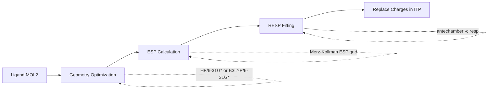

# Force Fields Guide

Force fields are the mathematical models that describe atomic interactions in molecular dynamics. **Choosing the right force field combination is critical for simulation accuracy**. PRISM supports multiple force field families for both proteins and ligands.

!!! example "Quick Start"
    ```bash
    # Default (GAFF + amber99sb)
    prism protein.pdb ligand.mol2 -o output

    # High accuracy (OpenFF + AMBER14SB)
    prism protein.pdb ligand.sdf -o output --ligand-forcefield openff --forcefield amber14sb
    ```

## Quick Selection Guide

### Recommended Combinations

| Use Case | Protein FF | Ligand FF | Water | Command |
|----------|-----------|-----------|-------|---------|
| **General Drug Discovery** | AMBER14SB | GAFF2 | TIP3P | `--forcefield amber14sb --ligand-forcefield gaff2` |
| **High Accuracy** | AMBER14SB | OpenFF | TIP3P | `--forcefield amber14sb --ligand-forcefield openff` |
| **CHARMM Ecosystem** | CHARMM36 | CGenFF | TIPS3P | `--forcefield charmm36 --ligand-forcefield cgenff` |
| **Literature Match** | AMBER99SB-ILDN | GAFF | TIP3P | `--forcefield amber99sb-ildn --ligand-forcefield gaff` |
| **Small Molecules** | OPLS-AA | OPLS-AA | TIP4P | `--forcefield oplsaa --ligand-forcefield opls` |

### Quick Examples

```bash
# Default (fast setup, good results)
prism protein.pdb ligand.mol2 -o output

# High accuracy (modern force fields)
prism protein.pdb ligand.sdf -o output \
  --forcefield amber14sb \
  --ligand-forcefield openff \
  --water tip3p

# CHARMM-based workflow
prism protein.pdb ligand.mol2 -o output \
  --forcefield charmm36 \
  --ligand-forcefield cgenff \
  --forcefield-path /path/to/cgenff_files \
  --water tips3p
```

---

## Protein Force Fields

### AMBER Family (Recommended)

The AMBER force fields are the most widely used for biomolecular simulations.

#### AMBER99SB
```bash
prism protein.pdb ligand.mol2 -o output --forcefield amber99sb
```
- **Year**: 2006
- **Best for**: General protein simulations, broad compatibility
- **Strengths**: Well-tested, stable, large validation dataset
- **Limitations**: Some α-helix bias, limited side chain sampling
- **Water**: TIP3P (default)

#### AMBER99SB-ILDN
```bash
prism protein.pdb ligand.mol2 -o output --forcefield amber99sb-ildn
```
- **Year**: 2010
- **Best for**: Improved side chain dynamics
- **Strengths**: Better χ1/χ2 rotamer distributions, reduced helix bias
- **Limitations**: Still uses AMBER99SB backbone
- **Water**: TIP3P
- **Citation**: Lindorff-Larsen et al., Proteins (2010)

#### AMBER14SB ⭐ **Recommended**
```bash
prism protein.pdb ligand.mol2 -o output --forcefield amber14sb
```
- **Year**: 2015
- **Best for**: **Most modern applications, drug discovery**
- **Strengths**:
  - Improved backbone and side chain parameters
  - Better agreement with NMR data
  - Fixed α-helix overstabilization
- **Water**: TIP3P
- **Citation**: Maier et al., J. Chem. Theory Comput. (2015)

#### AMBER03
```bash
prism protein.pdb ligand.mol2 -o output --forcefield amber03
```
- **Year**: 2003
- **Best for**: Specific compatibility with older studies
- **Note**: Generally superseded by newer versions

---

### CHARMM Family

CHARMM force fields excel for membrane proteins and lipid systems.

#### CHARMM36
```bash
prism protein.pdb ligand.mol2 -o output \
  --forcefield charmm36 \
  --water tips3p
```
- **Year**: 2012-2017
- **Best for**: Membrane proteins, protein-lipid interactions
- **Strengths**: Excellent lipid parameters, good protein conformations
- **Water**: TIPS3P (modified TIP3P for CHARMM)
- **Ligand**: Use CGenFF for consistency
- **Citation**: Best et al., J. Chem. Theory Comput. (2012)

#### CHARMM27
```bash
prism protein.pdb ligand.mol2 -o output --forcefield charmm27
```
- **Year**: 2004
- **Note**: Superseded by CHARMM36

---

### OPLS Family

OPLS-AA excels for small molecule interactions.

#### OPLS-AA/L
```bash
prism protein.pdb ligand.mol2 -o output \
  --forcefield oplsaa \
  --water tip4p
```
- **Year**: 2001-2005
- **Best for**: Small molecule interactions, organic chemistry
- **Strengths**: Excellent liquid properties, validated against QM
- **Water**: TIP4P (better with OPLS)
- **Ligand**: Use OPLS-AA ligand FF for consistency
- **Citation**: Jorgensen et al., J. Am. Chem. Soc. (1996)

---

### GROMOS Family

```bash
prism protein.pdb ligand.mol2 -o output \
  --forcefield gromos96 \
  --water spc
```
- **Best for**: United-atom simulations, faster calculations
- **Note**: United-atom (no explicit hydrogens on carbons)
- **Water**: SPC or SPC/E

---

## Ligand Force Fields (8+ Options)

PRISM supports **8+ ligand force field generators**. Choose based on accuracy needs, compatibility, and chemical coverage.

### Comparison Table

| Force Field | Method | Charge Model | Coverage | Speed | Accuracy | Requires |
|-------------|--------|--------------|----------|-------|----------|----------|
| **GAFF** | Rule-based | AM1-BCC | Excellent | Fast | Good | AmberTools |
| **GAFF2** | Improved rules | AM1-BCC | Excellent | Fast | Better | AmberTools |
| **OpenFF** | Data-driven | AM1-BCC-ELF10 | Very Good | Medium | Excellent | OpenFF |
| **CGenFF** | CHARMM-based | CGenFF server | Good | Medium | Good | Web download |
| **OPLS-AA** | Server | CM1A/CM5 | Good | Medium | Very Good | Internet |
| **MMFF** | SwissParam | MMFF94 | Good | Fast | Fair | Internet |
| **MATCH** | SwissParam | MATCH | Good | Fast | Fair | Internet |
| **Hybrid** | SwissParam | Mixed | Good | Fast | Fair | Internet |

---

### 1. GAFF (General AMBER Force Field)

**Default choice - fast and reliable**

```bash
# Using GAFF
prism protein.pdb ligand.mol2 -o output --ligand-forcefield gaff
```

**Details:**
- **Method**: Rule-based atom typing
- **Charges**: AM1-BCC (semi-empirical)
- **Coverage**: Excellent - most organic molecules
- **Speed**: Fast (~1 minute)
- **Accuracy**: Good for most applications
- **Input**: MOL2 (with correct atom types)
- **Requirements**: AmberTools, ACPYPE

**Best for:**
- Rapid prototyping
- High-throughput screening
- Standard drug-like molecules

**Workflow:**
```
ligand.mol2 → antechamber (AM1-BCC) → parmchk2 → ACPYPE → GROMACS
```

---

### 2. GAFF2 (Improved GAFF)

**Recommended over GAFF for new projects**

```bash
# Using GAFF2
prism protein.pdb ligand.mol2 -o output --ligand-forcefield gaff2
```

**Details:**
- **Method**: Improved rule-based parameters
- **Charges**: AM1-BCC
- **Improvements**: Better torsion parameters, expanded coverage
- **Speed**: Same as GAFF
- **Accuracy**: ~10-15% improvement over GAFF

**Best for:**
- Modern drug discovery projects
- When GAFF is too inaccurate but OpenFF is unavailable
- Compatibility with AMBER ecosystems

**Advantages over GAFF:**
- Better torsional barriers
- Improved bond/angle parameters
- Validated against larger dataset

---

### 3. OpenFF (Open Force Field) ⭐

**Most accurate modern force field for small molecules**

```bash
# Using OpenFF
prism protein.pdb ligand.sdf -o output --ligand-forcefield openff
```

**Details:**
- **Method**: Data-driven, fitted to QM calculations
- **Charges**: AM1-BCC-ELF10 or RESP
- **Coverage**: Very good organic molecules
- **Speed**: Medium (~2-5 minutes)
- **Accuracy**: **Excellent** - best for binding free energy
- **Input**: SDF (preferred), MOL2
- **Requirements**: OpenFF Toolkit, OpenFF Interchange

**Best for:**
- High-accuracy studies
- Binding free energy calculations
- Novel chemical scaffolds
- Publication-quality results

**Workflow:**
```
ligand.sdf → OpenFF Toolkit → Parameter assignment → Interchange → GROMACS
```

**Advantages:**
- Systematic optimization against QM
- Regular updates and improvements
- Explicit uncertainty quantification
- Best choice for FEP/TI calculations

---

### 4. CGenFF (CHARMM General Force Field)

**For CHARMM-based workflows**

```bash
# Step 1: Upload ligand to https://cgenff.umaryland.edu/
# Step 2: Download parameter files to /path/to/cgenff/

# Using CGenFF
prism protein.pdb ligand.mol2 -o output \
  --ligand-forcefield cgenff \
  --forcefield-path /path/to/cgenff_files
```

**Details:**
- **Method**: Web-based parameterization
- **Charges**: CGenFF server assignment
- **Coverage**: Good for drug-like molecules
- **Speed**: Manual (web upload)
- **Accuracy**: Good, especially with CHARMM protein FF
- **Requirements**: Web-downloaded files

**Best for:**
- CHARMM36 protein force field users
- Membrane protein simulations
- Consistency with CHARMM-GUI workflows

**Workflow:**
```
Upload to ParamChem → Download .str file → PRISM converts → GROMACS
```

**Note:** Requires manual web interaction, not suitable for automation

---

### 5. OPLS-AA (via LigParGen)

**Excellent for liquid properties**

```bash
# Using OPLS-AA
prism protein.pdb ligand.mol2 -o output --ligand-forcefield opls
```

**Details:**
- **Method**: LigParGen web server API
- **Charges**: CM1A (or CM5 for higher accuracy)
- **Coverage**: Good for organic molecules
- **Speed**: Medium (~2-3 minutes, requires internet)
- **Accuracy**: Very good for small molecules
- **Requirements**: Internet connection, RDKit

**Best for:**
- OPLS-AA protein force field users
- Small molecule interactions
- Liquid-phase properties
- Organic chemistry simulations

**Workflow:**
```
ligand.mol2 → LigParGen API → Server processing → Download → GROMACS
```

**Advantages:**
- Well-validated for organic liquids
- Consistent with OPLS protein FF
- Good solvation properties

---

### 6-8. SwissParam Force Fields (MMFF, MATCH, Hybrid)

**Quick parameterization via SwissParam server**

```bash
# MMFF-based
prism protein.pdb ligand.mol2 -o output --ligand-forcefield mmff

# MATCH-based
prism protein.pdb ligand.mol2 -o output --ligand-forcefield match

# Hybrid MMFF/MATCH
prism protein.pdb ligand.mol2 -o output --ligand-forcefield hybrid
```

**Details:**
- **Method**: SwissParam web server API
- **Charges**: MMFF94 or MATCH
- **Coverage**: Good for most organics
- **Speed**: Fast (~1-2 minutes, requires internet)
- **Accuracy**: Fair to good
- **Requirements**: Internet connection

**MMFF (Merck Molecular Force Field):**
- Classical pharmaceutical force field
- Good for drug-like molecules
- Fast parameterization

**MATCH:**
- More modern parameterization
- Better coverage of functional groups

**Hybrid:**
- Combines MMFF and MATCH
- Aims for best of both

**Best for:**
- Quick testing
- Preliminary simulations
- When other methods fail
- Exotic chemistry

**Limitations:**
- Lower accuracy than OpenFF
- Less validation than GAFF
- Not ideal for quantitative studies

---

## Gaussian RESP Charges

For the highest-quality charge assignments, PRISM can use Gaussian to compute RESP charges instead of the default AM1-BCC method:

```bash
# HF/6-31G* RESP charges (standard for AMBER)
prism protein.pdb ligand.mol2 -o output --gaussian hf

# DFT-level RESP charges (B3LYP)
prism protein.pdb ligand.mol2 -o output --gaussian dft

# With geometry optimization before charge calculation
prism protein.pdb ligand.mol2 -o output --gaussian hf --isopt opt

# From a pre-computed RESP file
prism protein.pdb ligand.mol2 -o output --respfile charges.resp
```

| Flag | Description | Default |
| --- | --- | --- |
| `--gaussian` / `-g` | Gaussian method (`hf` or `dft`) | off |
| `--isopt` | Optimization level before RESP | none |
| `--respfile` / `-rf` | Path to pre-computed RESP file | none |
| `--nproc` | Gaussian CPU cores | `16` |
| `--mem` | Gaussian memory | `4GB` |

!!! info "Gaussian Required"
    This feature requires a working Gaussian installation accessible from the command line. The resulting RESP charges replace the default AM1-BCC charges for GAFF/GAFF2.

### Theory and Workflow

The default AM1-BCC method uses the semi-empirical AM1 Hamiltonian to compute Mulliken charges, then applies bond charge corrections (BCC) to approximate HF/6-31G* electrostatic potentials. While fast, this approach can be inaccurate for molecules with unusual electronic structure. RESP charges from ab initio calculations provide a more rigorous alternative.

#### Step 1: Geometry Optimization (Optional)

When `--isopt opt` is specified, PRISM first optimizes the ligand geometry at the chosen level of theory:

- **HF mode:** HF/6-31G* (Hartree-Fock, standard for AMBER force fields)
- **DFT mode:** B3LYP/6-31G* (hybrid density functional, better for conjugated systems)

This ensures the charge calculation is performed on a quantum-mechanically consistent geometry rather than on the crystallographic or docked pose.

#### Step 2: Electrostatic Potential (ESP) Calculation

Gaussian computes the molecular electrostatic potential (ESP) on a grid of points surrounding the molecule using the Merz-Kollman scheme:

$$
V_{\text{ESP}}(\mathbf{r}) = \sum_A \frac{Z_A}{|\mathbf{r} - \mathbf{R}_A|} - \int \frac{\rho(\mathbf{r}')}{|\mathbf{r} - \mathbf{r}'|} d\mathbf{r}'
$$

where $Z_A$ and $\mathbf{R}_A$ are nuclear charges and positions, and $\rho(\mathbf{r}')$ is the electron density from the HF or DFT wavefunction. The ESP is evaluated at multiple layers of points on van der Waals surfaces (controlled by `IOp(6/33=2,6/42=6)` in the Gaussian route section).

#### Step 3: RESP Charge Fitting

The **Restrained Electrostatic Potential (RESP)** method fits atom-centered point charges $\{q_i\}$ to reproduce the quantum-mechanical ESP. The objective function minimizes:

$$
\chi^2_{\text{RESP}} = \sum_{k=1}^{K} \left[ V_{\text{ESP}}(\mathbf{r}_k) - \sum_{i=1}^{M} \frac{q_i}{|\mathbf{r}_k - \mathbf{R}_i|} \right]^2 + a \sum_{i=1}^{M} \left( q_i^2 - b^2 \right)
$$

subject to the constraint:

$$
\sum_{i=1}^{M} q_i = Q_{\text{total}}
$$

where $K$ is the number of ESP grid points, $M$ is the number of atoms, $Q_{\text{total}}$ is the net molecular charge, and $a$ is the restraint weight (default $a = 0.0005$ for stage 1, $a = 0.001$ for stage 2). The hyperbolic restraint penalty $a(q_i^2 - b^2)$ drives chemically buried atoms toward zero charge, preventing unphysical charge buildup on atoms poorly constrained by the ESP grid.

RESP fitting is performed by `antechamber` (AmberTools) in a standard two-stage procedure, and the resulting charges are automatically substituted into the GROMACS `.itp` topology file, replacing the default AM1-BCC values.

#### Complete Workflow



If Gaussian (`g16`) is available on the system, PRISM executes the entire workflow automatically. Otherwise, it generates a `charge.sh` script that can be run on a machine with Gaussian installed, and the resulting `ligand_resp.mol2` file can be provided back via `--respfile`.

---

## Water Models

### TIP3P (Default)

```bash
prism protein.pdb ligand.mol2 -o output --water tip3p
```

- **Best for**: AMBER force fields, fastest
- **Properties**: Reasonable density, fast diffusion
- **Note**: Default for most applications

### TIP4P

```bash
prism protein.pdb ligand.mol2 -o output --water tip4p
```

- **Best for**: OPLS force fields, better properties
- **Properties**: More accurate density, structure
- **Note**: Slightly slower than TIP3P

### TIPS3P

```bash
prism protein.pdb ligand.mol2 -o output --water tips3p
```

- **Best for**: CHARMM force fields
- **Properties**: Modified TIP3P for CHARMM compatibility
- **Note**: Use with CHARMM36

### SPC/E

```bash
prism protein.pdb ligand.mol2 -o output --water spce
```

- **Best for**: GROMOS, better diffusion
- **Properties**: Best diffusion constant, good density

---

## Force Field Selection Strategy

### Decision Tree

```
Start
  |
  ├─ Need highest accuracy?
  |   └─ YES → OpenFF + AMBER14SB
  |   └─ NO → Continue
  |
  ├─ Need fast screening?
  |   └─ YES → GAFF2 + AMBER99SB
  |   └─ NO → Continue
  |
  ├─ Using CHARMM ecosystem?
  |   └─ YES → CGenFF + CHARMM36
  |   └─ NO → Continue
  |
  ├─ Small molecule focus?
  |   └─ YES → OPLS-AA (both)
  |   └─ NO → GAFF2 + AMBER14SB
```

### By Application

**Binding Free Energy (FEP/TI):**
```bash
prism protein.pdb ligand.sdf -o output \
  --forcefield amber14sb \
  --ligand-forcefield openff
```

**Virtual Screening (High-throughput):**
```bash
prism protein.pdb ligand.mol2 -o output \
  --forcefield amber99sb \
  --ligand-forcefield gaff2 \
  --production-ns 100
```

**Membrane Proteins:**
```bash
prism protein.pdb ligand.mol2 -o output \
  --forcefield charmm36 \
  --ligand-forcefield cgenff \
  --forcefield-path /path/to/cgenff
```

**Novel Chemistry:**
```bash
# Try in order:
1. OpenFF (best coverage)
2. OPLS-AA (via LigParGen)
3. MMFF/MATCH (SwissParam)
```

---

## Force Field Compatibility

### Compatible Combinations

| Protein FF | Compatible Ligand FFs | Compatible Water |
|------------|----------------------|------------------|
| AMBER99SB | GAFF, GAFF2, OpenFF, OPLS | TIP3P, TIP4P, SPC/E |
| AMBER14SB | GAFF, GAFF2, OpenFF, OPLS | TIP3P, TIP4P |
| CHARMM36 | CGenFF (preferred), GAFF | TIPS3P |
| OPLS-AA | OPLS-AA (preferred), GAFF | TIP4P, TIP3P |

### Mixing Force Fields

**Generally OK:**
- AMBER protein + GAFF/GAFF2/OpenFF ligand ✓
- CHARMM36 + CGenFF ✓
- OPLS-AA protein + OPLS-AA ligand ✓

**Not Recommended:**
- CHARMM36 + OpenFF ⚠ (different parametrization philosophy)
- OPLS-AA + GAFF ⚠ (can work but less validated)

---

## Advanced Topics

### Custom Force Fields

PRISM can install additional force fields:

```bash
# Install custom force fields from PRISM configs
prism --install-forcefields

# Interactive installation
# Copies force fields to GROMACS directory
```

### Validating Force Field Choice

After building, validate your choice:

```python
import mdtraj as md
import numpy as np

# Load system
traj = md.load("output/GMX_PROLIG_MD/solv_ions.gro")

# Check for clashes (atoms < 0.15 nm apart)
pairs = traj.topology.select_pairs("protein", "resname LIG")
distances = md.compute_distances(traj, pairs)[0]
clashes = np.sum(distances < 0.15)
print(f"Close contacts: {clashes}")

# Check ligand geometry
lig_atoms = traj.topology.select("resname LIG")
lig_traj = traj.atom_slice(lig_atoms)
rgyr = md.compute_rg(lig_traj)[0]
print(f"Ligand radius of gyration: {rgyr:.3f} nm")
```

### Force Field Citation

Always cite the force fields you use:

**AMBER14SB:**
```
Maier, J.A., Martinez, C., Kasavajhala, K., Wickstrom, L., Hauser, K.E., and Simmerling, C.
(2015). ff14SB: Improving the Accuracy of Protein Side Chain and Backbone Parameters from ff99SB.
J. Chem. Theory Comput. 11, 3696–3713.
```

**OpenFF:**
```
Boothroyd, S., Behara, P.K., Madin, O.C., et al. (2023).
Development and Benchmarking of Open Force Field 2.0.0: The Sage Small Molecule Force Field.
J. Chem. Theory Comput. 19, 3251–3275.
```

**GAFF:**
```
Wang, J., Wolf, R.M., Caldwell, J.W., Kollman, P.A., and Case, D.A. (2004).
Development and testing of a general AMBER force field.
J. Comput. Chem. 25, 1157–1174.
```

---

## Troubleshooting

### "Force field not found"

```bash
# List available force fields
prism --list-forcefields

# Check GROMACS installation
gmx pdb2gmx -h | grep "Force fields"
```

### "Ligand parameterization failed"

Try alternatives in order:
```bash
# 1. Try OpenFF
prism protein.pdb ligand.sdf -o output --ligand-forcefield openff

# 2. Try OPLS-AA
prism protein.pdb ligand.mol2 -o output --ligand-forcefield opls

# 3. Try SwissParam
prism protein.pdb ligand.mol2 -o output --ligand-forcefield mmff
```

### "Unusual atom types"

OpenFF has best coverage:
```bash
prism protein.pdb ligand.sdf -o output --ligand-forcefield openff
```

---

<div class="whats-next" markdown>

## What's Next

- [Build a system with your chosen force field](building-systems.md)
- [Run simulations with GROMACS](running-simulations.md)
- [Analyze trajectories and validate results](analysis-tools.md)
- [Use Gaussian RESP charges for higher accuracy](#gaussian-resp-charges)

</div>
