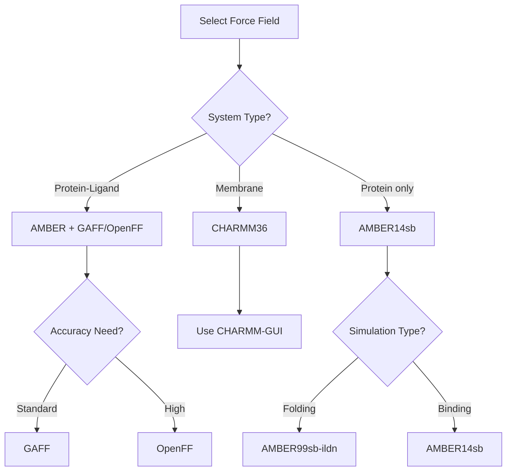

# Force Fields Guide

Force fields are mathematical models that describe molecular interactions. Choosing the right force field is crucial for accurate simulations. PRISM supports multiple force field combinations for proteins and ligands.

## Overview

PRISM uses:
- **Protein force fields**: AMBER, CHARMM, OPLS families
- **Ligand force fields**: GAFF or OpenFF
- **Water models**: TIP3P, TIP4P, SPC/E

## Quick Selection Guide

### For Drug Discovery

```bash
# Recommended: AMBER with GAFF
prism protein.pdb ligand.mol2 -o output \
  --forcefield amber14sb \
  --ligand-forcefield gaff \
  --water tip3p
```

### For Modern Accuracy

```bash
# Using OpenFF for better ligand parameters
prism protein.pdb ligand.sdf -o output \
  --forcefield amber14sb \
  --ligand-forcefield openff \
  --water tip3p
```

### For Compatibility with Literature

```bash
# Match published studies
prism protein.pdb ligand.mol2 -o output \
  --forcefield amber99sb-ildn \
  --ligand-forcefield gaff \
  --water tip3p
```

## Protein Force Fields

### AMBER Family

The AMBER force fields are widely used and well-validated:

#### amber99sb
- **Use case**: General protein simulations
- **Strengths**: Well-tested, broad compatibility
- **Limitations**: Older, some known issues with loops

```bash
prism protein.pdb ligand.mol2 -o output --forcefield amber99sb
```

#### amber99sb-ildn
- **Use case**: Improved side chain dynamics
- **Strengths**: Better χ1 and χ2 distributions
- **Limitations**: Still uses amber99sb backbone

```bash
prism protein.pdb ligand.mol2 -o output --forcefield amber99sb-ildn
```

#### amber14sb (Recommended)
- **Use case**: Modern general-purpose simulations
- **Strengths**: Improved backbone and side chains
- **Best for**: Most drug discovery applications

```bash
prism protein.pdb ligand.mol2 -o output --forcefield amber14sb
```

#### amber03
- **Use case**: Specific compatibility needs
- **Strengths**: Good for some specific systems
- **Note**: Generally superseded by newer versions

### CHARMM Family

#### charmm36
- **Use case**: Membrane proteins, lipids, carbohydrates
- **Strengths**: Excellent for complex systems
- **Water model**: Use tips3p (CHARMM-modified TIP3P)

```bash
prism protein.pdb ligand.mol2 -o output \
  --forcefield charmm36 \
  --water tips3p
```

#### charmm27
- **Use case**: Legacy compatibility
- **Note**: Superseded by charmm36

### OPLS Family

#### opls-aa
- **Use case**: Small molecule interactions
- **Strengths**: Good for protein-ligand systems
- **Water model**: TIP4P recommended

```bash
prism protein.pdb ligand.mol2 -o output \
  --forcefield oplsaa \
  --water tip4p
```

### Force Field Comparison

| Force Field | Proteins | Nucleic Acids | Lipids | Carbohydrates | Small Molecules |
|------------|----------|---------------|--------|---------------|-----------------|
| amber14sb | Excellent | Good | Limited | Limited | With GAFF/OpenFF |
| amber99sb-ildn | Good | Good | Limited | Limited | With GAFF/OpenFF |
| charmm36 | Excellent | Excellent | Excellent | Excellent | With CGenFF* |
| opls-aa | Good | Limited | Limited | Limited | Good |

*CGenFF not directly supported by PRISM

## Ligand Force Fields

### GAFF (General AMBER Force Field)

GAFF is the traditional choice for drug-like molecules:

```bash
# Automatic charge calculation (AM1-BCC)
prism protein.pdb ligand.mol2 -o output --ligand-forcefield gaff
```

**Advantages:**
- Extensive validation
- Compatible with AMBER protein force fields
- Well-understood limitations

**Process:**
1. Atom typing using AMBER types
2. AM1-BCC charge calculation
3. Missing parameter generation with parmchk2

**Best for:**
- Drug-like molecules
- Systems where comparability with literature is important
- Quick setup with reasonable accuracy

### OpenFF (Open Force Field)

OpenFF represents modern force field development:

```bash
# Latest OpenFF version
prism protein.pdb ligand.sdf -o output --ligand-forcefield openff
```

**Advantages:**
- Systematically improved parameters
- Better coverage of chemical space
- Active development and updates
- Data-driven parameterization

**Process:**
1. SMIRKS-based atom typing
2. AM1-BCC-ELF10 charges (improved version)
3. Parameters from curated quantum chemistry data

**Best for:**
- Novel chemical matter
- Highest accuracy requirements
- Systems with unusual functional groups

### Comparing GAFF vs OpenFF

| Aspect | GAFF | OpenFF |
|--------|------|--------|
| Maturity | Very mature (20+ years) | Newer (5+ years) |
| Coverage | Good for drug-like | Broader chemical space |
| Validation | Extensive | Growing rapidly |
| Updates | Stable/infrequent | Regular improvements |
| Charges | AM1-BCC | AM1-BCC-ELF10 |
| Parameters | Rule-based | Data-driven |

## Water Models

### TIP3P
Most common water model:

```bash
prism protein.pdb ligand.mol2 -o output --water tip3p
```

- **Pros**: Fast, well-tested, standard choice
- **Cons**: Some properties not perfectly reproduced
- **Use with**: AMBER force fields

### TIP4P
Four-site water model:

```bash
prism protein.pdb ligand.mol2 -o output --water tip4p
```

- **Pros**: Better bulk properties
- **Cons**: Slightly slower than TIP3P
- **Use with**: OPLS force fields

### SPC/E
Extended simple point charge:

```bash
prism protein.pdb ligand.mol2 -o output --water spce
```

- **Pros**: Good diffusion properties
- **Cons**: Less common in biomolecular simulations
- **Use with**: GROMOS force fields

### Water Model Selection

| Property | TIP3P | TIP4P | SPC/E |
|----------|-------|-------|-------|
| Speed | Fastest | Slower | Fast |
| Density | Good | Better | Good |
| Diffusion | Too fast | Good | Better |
| Dielectric | Good | Better | Good |
| Standard use | AMBER/CHARMM | OPLS | GROMOS |

## Force Field Combinations

### Recommended Combinations

```python
# Standard drug discovery
combinations = {
    "standard": {
        "protein": "amber14sb",
        "ligand": "gaff",
        "water": "tip3p"
    },
    "high_accuracy": {
        "protein": "amber14sb",
        "ligand": "openff",
        "water": "tip3p"
    },
    "membrane": {
        "protein": "charmm36",
        "ligand": "cgenff",  # Requires manual setup
        "water": "tips3p"
    },
    "compatibility": {
        "protein": "amber99sb-ildn",
        "ligand": "gaff",
        "water": "tip3p"
    }
}
```

### Implementation Examples

```python
import prism

# Standard combination
system = prism.PRISMSystem(
    "protein.pdb",
    "ligand.mol2",
    output_dir="standard",
    ligand_forcefield="gaff"
)
system.config['forcefield']['name'] = "amber14sb"
system.config['water_model']['name'] = "tip3p"
system.build()

# High accuracy with OpenFF
system = prism.PRISMSystem(
    "protein.pdb",
    "ligand.sdf",
    output_dir="accurate",
    ligand_forcefield="openff"
)
system.build()
```

## Checking Available Force Fields

### List Installed Force Fields

```bash
# Check what's available in your GROMACS
prism --list-forcefields
```

### Verify Force Field Files

```python
import os
import subprocess

# Check GROMACS data directory
result = subprocess.run(
    ["gmx", "pdb2gmx", "-h"],
    capture_output=True,
    text=True
)

# Parse available force fields
for line in result.stdout.split('\n'):
    if '.ff' in line:
        print(line)
```

## Advanced Force Field Topics

### Modified Force Fields

#### Custom Parameters

```python
# Generate standard parameters
builder = prism.PRISMBuilder(
    "protein.pdb",
    "ligand.mol2",
    "output"
)
lig_dir = builder.generate_ligand_forcefield()

# Modify parameters in LIG.itp
with open(f"{lig_dir}/LIG.itp", 'r') as f:
    topology = f.read()

# Make modifications (e.g., adjust dihedrals)
# ...

with open(f"{lig_dir}/LIG_modified.itp", 'w') as f:
    f.write(modified_topology)
```

#### Force Field Mixing

Generally NOT recommended, but sometimes necessary:

```python
# Use AMBER for protein, OPLS parameters for specific residues
# Requires careful validation!
```

### Polarizable Force Fields

PRISM doesn't directly support polarizable force fields, but you can:

1. Generate initial structures with PRISM
2. Convert to polarizable force field manually
3. Run with appropriate MD engine

### United Atom Force Fields

For faster simulations with reduced accuracy:

```bash
# GROMOS united atom (not directly supported)
# Generate with PRISM, then convert
```

## Validation and Testing

### Comparing Force Fields

```python
import prism
import mdtraj as md
import numpy as np

# Build same system with different force fields
force_fields = ["amber99sb", "amber14sb", "amber99sb-ildn"]

for ff in force_fields:
    system = prism.PRISMSystem(
        "protein.pdb",
        "ligand.mol2",
        output_dir=f"test_{ff}",
        forcefield=ff
    )
    system.build()
    
    # Run short simulation
    sim = prism.model(f"test_{ff}/GMX_PROLIG_MD")
    sim.run(engine="gmx", stages=["em"])
    
    # Compare energies
    # ...
```

### Validating Parameters

```python
# Check ligand parameters
def validate_ligand_parameters(itp_file):
    """Check for missing parameters or unusual values"""
    
    with open(itp_file) as f:
        content = f.read()
    
    # Check for missing parameters (zeros)
    if ' 0.00000 ' in content and 'charge' not in content:
        print("Warning: Zero parameters found")
    
    # Check for very large force constants
    import re
    force_constants = re.findall(r'(\d+\.\d+)\s+;\s*force', content)
    for fc in force_constants:
        if float(fc) > 10000:
            print(f"Warning: Large force constant: {fc}")
```

## Force Field Selection Flowchart



## Best Practices

### 1. Consistency
- Use compatible force fields (e.g., AMBER + GAFF)
- Don't mix force field families without validation
- Document your choices

### 2. Validation
- Compare with experimental data when available
- Run control simulations
- Check parameter coverage

### 3. Updates
- Use recent force field versions
- Check for corrections/updates
- Consider new developments

### 4. Documentation
```python
# Always document force field choices
metadata = {
    "protein_ff": "amber14sb",
    "ligand_ff": "gaff-2.11",
    "water_model": "tip3p",
    "salt": "Joung-Cheatham ions",
    "rationale": "Standard protocol for drug-like molecules"
}

import json
with open("force_field_metadata.json", "w") as f:
    json.dump(metadata, f, indent=2)
```

## Common Issues

### Issue: "Force field XX not found"

```bash
# Check installation
prism --list-forcefields

# Use available alternative
prism protein.pdb ligand.mol2 -o output --forcefield amber99sb
```

### Issue: "Parameters not found for atom type"

```python
# This happens with unusual chemistry
# Solutions:

# 1. Try OpenFF (better coverage)
prism protein.pdb ligand.sdf -o output --ligand-forcefield openff

# 2. Check ligand structure
from rdkit import Chem
mol = Chem.MolFromMol2File("ligand.mol2")
# Visualize and check for errors

# 3. Simplify molecule for testing
# Remove problematic groups and test
```

### Issue: "Incompatible water model"

```bash
# Check force field - water model compatibility
# AMBER force fields: use tip3p or tip4p
# CHARMM: use tips3p
# OPLS: use tip4p
```

## Performance Considerations

### Force Field Speed

Relative computational cost:

1. **United atom** (fastest, not in PRISM)
2. **TIP3P water** (standard)
3. **TIP4P water** (10% slower)
4. **Polarizable** (2-3x slower, not in PRISM)

### Optimization Tips

```python
# For large-scale screening, prioritize speed
config = {
    "forcefield": "amber99sb",  # Faster than amber14sb
    "ligand_forcefield": "gaff",  # Faster than OpenFF
    "water": "tip3p",  # Fastest water model
    "constraints": "h-bonds",  # Allows 2 fs timestep
}
```

## Future Developments

### Coming to PRISM
- Machine learning force fields
- Automated force field selection
- QM/MM interfaces

### Current Alternatives
For unsupported force fields:
1. Generate structure with PRISM
2. Convert topology manually
3. Use specialized tools

## Summary

### Recommended Starting Point

For most users:
```bash
prism protein.pdb ligand.mol2 -o output \
  --forcefield amber14sb \
  --ligand-forcefield gaff \
  --water tip3p
```

### When to Use What

- **GAFF**: Standard drug discovery, compatibility with literature
- **OpenFF**: Novel chemistry, highest accuracy
- **amber14sb**: Modern protein force field
- **amber99sb-ildn**: When specifically needed for comparison
- **charmm36**: Membranes, lipids, carbohydrates

## Next Steps

- [Build your system](building-systems.md)
- [Run simulations](running-simulations.md)
- [Analyze results](analysis-tools.md)