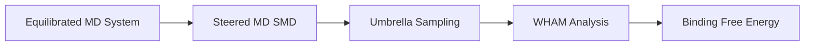

# PMF Calculations

## Overview

PRISM provides a complete **Potential of Mean Force (PMF)** calculation workflow for determining protein-ligand binding free energies. The PMF module automates the entire process from equilibrated MD systems to binding energy estimates using umbrella sampling and WHAM analysis.

!!! info "What is PMF?"
    The Potential of Mean Force (PMF) describes the free energy change along a reaction coordinate. For protein-ligand binding, this typically means pulling the ligand away from the binding pocket and calculating the binding free energy from the resulting energy profile.

## Workflow Overview

The PRISM PMF workflow consists of three main stages:



1. **Steered Molecular Dynamics (SMD)**: Pull the ligand away from the protein
2. **Umbrella Sampling**: Generate configurations along the unbinding pathway
3. **WHAM Analysis**: Calculate the PMF profile and binding free energy

## Quick Start

### One-Step PMF Calculation

For a fully automated PMF calculation:

```python
import prism as pm

# Run complete PMF workflow
results = pm.run_pmf_workflow(
    md_system_dir="./my_system",      # Directory with equilibrated MD
    output_dir="./pmf_results"
)

print(f"Binding energy: {results['binding_energy']['value']:.2f} kcal/mol")
print(f"Standard error: {results['binding_energy']['error']:.2f} kcal/mol")
```

### Step-by-Step Control

For more control over each stage:

```python
import prism as pm

# Create PMF system
pmf_sys = pm.pmf_system("./my_system", "./pmf_results")

# Step 1: Build and run SMD
smd_results = pmf_sys.build(step='smd')
# Manually run: bash ./pmf_results/pmf_smd/run_smd.sh

# Step 2: Build umbrella sampling windows
umbrella_results = pmf_sys.build_umbrella_step()
# Manually run: bash ./pmf_results/pmf_umbrella/run_all_umbrella.sh

# Step 3: Run WHAM analysis
analysis_results = pmf_sys.build_analysis_step()
print(f"Binding energy: {analysis_results['binding_energy']['value']:.2f} kcal/mol")
```

## Configuration

### Creating Configuration Files

PRISM provides templates for different accuracy levels:

```python
import prism as pm

# Fast calculations (for testing)
pm.create_pmf_config("pmf_fast.yaml", template="fast")

# Balanced (default)
pm.create_pmf_config("pmf_default.yaml", template="default")

# High accuracy
pm.create_pmf_config("pmf_accurate.yaml", template="accurate")
```

### Configuration Options

Example configuration file (`pmf_config.yaml`):

```yaml
# SMD Configuration
smd:
  pull_rate: 0.01          # nm/ps (slower = more accurate)
  nsteps: 1000000          # Total SMD steps
  pull_group1: "Protein"   # Reference group
  pull_group2: "LIG"       # Pulled group (ligand)
  pull_geometry: "distance"
  pull_dim: "Y Y Y"        # Pull in all directions

# Umbrella Sampling Configuration
umbrella:
  n_windows: 40            # Number of umbrella windows
  window_spacing: 0.05     # nm between windows
  force_constant: 3000     # kJ/mol/nm^2
  production_time_ps: 10000  # Production time per window

# WHAM Configuration
wham:
  temperature: 300         # K
  bins: 100                # Number of histogram bins
  tolerance: 1e-6          # Convergence tolerance
  iterations: 100000       # Max WHAM iterations
```

### Using Custom Configurations

```python
import prism as pm

# From file
results = pm.run_pmf_workflow(
    "./my_system",
    "./pmf_results",
    config="pmf_accurate.yaml"
)

# From dictionary
config = {
    'smd': {'pull_rate': 0.005, 'nsteps': 2000000},
    'umbrella': {'n_windows': 50, 'production_time_ps': 15000}
}
results = pm.run_pmf_workflow("./my_system", "./pmf_results", config=config)
```

## Detailed Workflow

### Stage 1: Steered Molecular Dynamics (SMD)

SMD gradually pulls the ligand away from the protein:

```python
# Prepare SMD simulation
smd_results = pm.run_pmf_step(
    "./my_system",
    "./pmf_results",
    step="smd",
    config={"smd": {"pull_rate": 0.01, "nsteps": 1000000}}
)

# SMD files are generated in ./pmf_results/pmf_smd/
# Run: bash ./pmf_results/pmf_smd/run_smd.sh
```

**Key SMD Parameters:**

- `pull_rate`: Pulling speed (0.005-0.02 nm/ps recommended)
  - Slower = more accurate but computationally expensive
  - Faster = less accurate but faster to run
- `nsteps`: Total simulation steps (typically 1-5M steps)
- `pull_geometry`: Usually "distance" for unbinding

### Stage 2: Umbrella Sampling

Generate restrained simulations along the unbinding pathway:

```python
# Prepare umbrella sampling windows
umbrella_results = pm.run_pmf_step(
    "./my_system",
    "./pmf_results",
    step="umbrella",
    config={
        "umbrella": {
            "n_windows": 40,
            "force_constant": 3000,
            "production_time_ps": 10000
        }
    }
)

# Run: bash ./pmf_results/pmf_umbrella/run_all_umbrella.sh
```

**Key Umbrella Parameters:**

- `n_windows`: Number of sampling windows (30-50 recommended)
  - More windows = better overlap = more accurate
- `window_spacing`: Distance between windows (0.05-0.1 nm)
- `force_constant`: Restraint strength (1000-5000 kJ/mol/nm²)
  - Higher = better sampling but requires more windows
- `production_time_ps`: Sampling time per window (5-20 ns)

### Stage 3: WHAM Analysis

Calculate the PMF profile and extract binding energy:

```python
# Run WHAM analysis
analysis_results = pm.run_pmf_step(
    "./my_system",
    "./pmf_results",
    step="analysis"
)

# Extract results
binding_energy = analysis_results['binding_energy']['value']  # kcal/mol
error = analysis_results['binding_energy']['error']           # kcal/mol
pmf_profile = analysis_results['pmf_profile']                 # Array of PMF values

print(f"ΔG_bind = {binding_energy:.2f} ± {error:.2f} kcal/mol")
```

**Output Files:**

- `pmf_profile.dat`: PMF values along reaction coordinate
- `pmf_plot.png`: Visualization of PMF profile
- `binding_energy.txt`: Summary of binding energy
- `wham.log`: Detailed WHAM convergence information

## Analysis and Visualization

### Examining PMF Profiles

```python
import matplotlib.pyplot as plt
import numpy as np

# Load PMF profile
data = np.loadtxt("./pmf_results/pmf_analysis/pmf_profile.dat")
distance = data[:, 0]  # nm
pmf = data[:, 1]       # kJ/mol

# Plot
plt.figure(figsize=(10, 6))
plt.plot(distance, pmf, 'b-', linewidth=2)
plt.xlabel('Distance (nm)', fontsize=14)
plt.ylabel('PMF (kJ/mol)', fontsize=14)
plt.title('Protein-Ligand Unbinding PMF', fontsize=16)
plt.grid(True, alpha=0.3)
plt.tight_layout()
plt.savefig('pmf_analysis.png', dpi=300)
```

### Checking Convergence

Monitor umbrella sampling convergence:

```bash
# Check if windows have sufficient overlap
cd pmf_results/pmf_umbrella
for dir in window_*/; do
    echo "$dir: $(tail -1 $dir/umbrella.log | awk '{print $2}')"
done

# WHAM convergence
grep "It" pmf_results/pmf_analysis/wham.log | tail -20
```

### Calculating Binding Affinity

Convert PMF binding energy to K_d:

```python
import numpy as np

# Binding energy in kcal/mol
dG_bind = -8.5  # Example value

# Convert to dissociation constant
R = 1.987e-3  # kcal/(mol·K)
T = 300       # K
Kd = np.exp(dG_bind / (R * T))

print(f"K_d = {Kd*1e9:.2f} nM")
```

## Best Practices

### Computational Resources

PMF calculations are computationally intensive:

| Stage | CPU Time | GPU Speedup | Parallelization |
|-------|----------|-------------|-----------------|
| SMD | 4-24 hours | 5-10× | Single run |
| Umbrella | 50-500 hours | 5-10× | Parallel windows |
| WHAM | <1 hour | N/A | Single run |

**Recommendations:**

- Use GPUs for SMD and umbrella sampling
- Run umbrella windows in parallel (40 windows × 10 ns = 400 ns total)
- Request cluster resources accordingly

### Ensuring Accuracy

1. **Check SMD pulling speed:**
   ```python
   # Too fast if force > 1000 kJ/mol/nm during pull
   # Reduce pull_rate if this occurs
   ```

2. **Verify umbrella overlap:**
   - Adjacent windows should overlap in configuration space
   - Check histogram overlap: `gmx wham -hist`

3. **Assess convergence:**
   - PMF should be smooth without large fluctuations
   - Binding energy error should be < 1 kcal/mol
   - Try increasing `production_time_ps` if error is large

4. **Validate results:**
   - Compare with experimental binding affinity if available
   - Test different force constants and window counts
   - Run multiple independent calculations

### Common Issues

!!! warning "Ligand breaks through protein"
    If the ligand pulls through the protein instead of unbinding:
    - Adjust pull direction in configuration
    - Use `pull_dim: "Y Y N"` to restrict pulling axis
    - Increase SMD force constant

!!! warning "Poor WHAM convergence"
    If WHAM doesn't converge:
    - Increase number of umbrella windows
    - Extend umbrella sampling time
    - Check for insufficient window overlap

!!! warning "Unrealistic binding energy"
    If binding energy seems wrong:
    - Verify system is properly equilibrated before PMF
    - Check that ligand is correctly parameterized
    - Ensure protein-ligand complex is stable in initial MD

## Advanced Usage

### Custom Pull Directions

For non-standard binding pockets:

```yaml
smd:
  pull_vec1: "0 0 0"      # Pull along specific vector
  pull_vec2: "1 0 0"      # X-direction only
  pull_geometry: "direction"
```

### Multiple Binding Modes

Calculate PMF for different unbinding pathways:

```python
# Pathway 1: Pull along Z-axis
config1 = {'smd': {'pull_dim': 'N N Y'}}
results1 = pm.run_pmf_workflow("./system", "./pmf_z", config=config1)

# Pathway 2: Pull along X-axis
config2 = {'smd': {'pull_dim': 'Y N N'}}
results2 = pm.run_pmf_workflow("./system", "./pmf_x", config=config2)

# Compare binding energies
print(f"Z-axis: {results1['binding_energy']['value']:.2f} kcal/mol")
print(f"X-axis: {results2['binding_energy']['value']:.2f} kcal/mol")
```

### Cluster Submission

Example SLURM script for umbrella sampling:

```bash
#!/bin/bash
#SBATCH --job-name=pmf_umbrella
#SBATCH --array=0-39           # 40 windows
#SBATCH --ntasks=1
#SBATCH --cpus-per-task=8
#SBATCH --gres=gpu:1
#SBATCH --time=24:00:00

# Load GROMACS
module load gromacs/2023-cuda

# Run specific umbrella window
cd pmf_results/pmf_umbrella/window_${SLURM_ARRAY_TASK_ID}
gmx mdrun -deffnm umbrella -v -nb gpu -pme gpu
```

## PMF Module Information

Check PMF module capabilities:

```python
import prism as pm

info = pm.get_pmf_info()
print(f"PMF module version: {info['version']}")
print(f"Supported force fields: {info['supported_forcefields']}")
print(f"Available templates: {info['templates']}")
```

## References

For more information on PMF calculations and umbrella sampling:

1. Torrie, G. M., & Valleau, J. P. (1977). *J. Comput. Phys.*, 23(2), 187-199.
2. Kumar, S., et al. (1992). *J. Comput. Chem.*, 13(8), 1011-1021.
3. Hub, J. S., et al. (2010). *J. Chem. Theory Comput.*, 6(10), 3713-3720.

## See Also

- [Running Simulations](running-simulations.md) - Equilibrating systems before PMF
- [Analysis Tools](analysis-tools.md) - Analyzing PMF trajectories
- [PMF API Reference](../api/pmf.md) - Detailed API documentation
- [PMF Tutorial](../tutorials/pmf-tutorial.md) - Step-by-step PMF example
