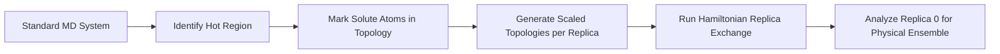

# Running MD Simulations

After building your protein-ligand system with PRISM, you're ready to run molecular dynamics simulations using GROMACS. This guide covers the complete simulation workflow from energy minimization to production MD.

!!! example "Quick Start"
    ```bash
    cd my_system/GMX_PROLIG_MD
    bash localrun.sh
    ```
    The auto-generated script runs the complete EM → NVT → NPT → Production workflow with checkpoint restart support.

---

## The MD Workflow

### Overview

PRISM follows the standard GROMACS workflow for biomolecular simulations:

```
1. Energy Minimization (EM)
   ↓ Remove bad contacts, relax structure

2. NVT Equilibration
   ↓ Heat system to target temperature (constant Volume)

3. NPT Equilibration
   ↓ Equilibrate pressure and density (constant Pressure)

4. Production MD
   ↓ Collect data for analysis
```

Each stage uses optimized MDP parameters generated by PRISM.

---

## Simulation Stages

### 1. Energy Minimization (EM)

**Purpose:** Remove bad contacts and steric clashes

**Generated Files:**
```
GMX_PROLIG_MD/
├── em/
│   ├── em.tpr      # Run input
│   ├── em.gro      # Minimized structure
│   ├── em.edr      # Energy data
│   └── em.log      # Log file
```

**Key Parameters (from em.mdp):**
```
integrator  = steep    # Steepest descent
emtol       = 200.0    # Force tolerance (kJ/mol/nm)
nsteps      = 10000    # Maximum steps
```

**Manual Execution:**
```bash
cd GMX_PROLIG_MD

# Create run input
gmx grompp -f ../mdps/em.mdp -c solv_ions.gro -r solv_ions.gro \
  -p topol.top -o em/em.tpr -maxwarn 1

# Run minimization
gmx mdrun -deffnm em/em -v
```

**Success Criteria:**
- Final potential energy < 0
- Force < 200 kJ/mol/nm
- No warnings about instabilities

**Check Results:**
```bash
# Extract and plot energy
gmx energy -f em/em.edr -o em_energy.xvg
# Select: Potential

# Check final energy (should be negative)
tail em/em.log | grep "Potential Energy"
```

---

### 2. NVT Equilibration

**Purpose:** Heat system to target temperature (310 K default)

**Generated Files:**
```
GMX_PROLIG_MD/
├── nvt/
│   ├── nvt.tpr     # Run input
│   ├── nvt.gro     # Final structure
│   ├── nvt.xtc     # Trajectory
│   ├── nvt.edr     # Energy data
│   ├── nvt.log     # Log file
│   └── nvt.cpt     # Checkpoint (for restart/continuation)
```

**Key Parameters (from nvt.mdp):**
```
integrator  = md           # Leap-frog MD
dt          = 0.002        # 2 fs time step
nsteps      = 250000       # 500 ps total
tcoupl      = V-rescale    # Temperature coupling
ref_t       = 310          # Target temperature (K)
tau_t       = 0.1          # Coupling time constant
```

**Manual Execution:**
```bash
# Create run input
gmx grompp -f ../mdps/nvt.mdp -c em/em.gro -r em/em.gro \
  -p topol.top -o nvt/nvt.tpr -maxwarn 1

# Run NVT (CPU)
gmx mdrun -deffnm nvt/nvt -v

# Or with GPU acceleration
gmx mdrun -deffnm nvt/nvt -v \
  -ntmpi 1 -ntomp 10 \
  -nb gpu -bonded gpu -pme gpu -gpu_id 0
```

**Success Criteria:**
- Temperature stabilizes at ~310 K
- No drift in total energy
- System remains stable

**Check Results:**
```bash
# Temperature vs time
echo "Temperature" | gmx energy -f nvt/nvt.edr -o nvt_temp.xvg

# Visualize (with xmgrace or Python)
xmgrace nvt_temp.xvg
```

Expected: Temperature oscillates around 310 K

---

### 3. NPT Equilibration

**Purpose:** Equilibrate pressure and density

**Generated Files:**
```
GMX_PROLIG_MD/
├── npt/
│   ├── npt.tpr     # Run input
│   ├── npt.gro     # Final structure
│   ├── npt.xtc     # Trajectory
│   ├── npt.edr     # Energy data
│   ├── npt.log     # Log file
│   └── npt.cpt     # Checkpoint
```

**Key Parameters (from npt.mdp):**
```
integrator  = md
dt          = 0.002
nsteps      = 250000       # 500 ps
tcoupl      = V-rescale
pcoupl      = C-rescale    # Pressure coupling (new)
ref_p       = 1.0          # Target pressure (bar)
tau_p       = 1.0          # Barostat time constant
compressibility = 4.5e-5   # Water compressibility
```

**Manual Execution:**
```bash
# Create run input
gmx grompp -f ../mdps/npt.mdp \
  -c nvt/nvt.gro -r nvt/nvt.gro -t nvt/nvt.cpt \
  -p topol.top -o npt/npt.tpr -maxwarn 1

# Run NPT
gmx mdrun -deffnm npt/npt -v \
  -ntmpi 1 -ntomp 10 \
  -nb gpu -bonded gpu -pme gpu -gpu_id 0
```

**Success Criteria:**
- Pressure stabilizes at ~1 bar
- Density stabilizes (~1000 kg/m³ for water)
- Box volume equilibrated

**Check Results:**
```bash
# Pressure and density
echo "Pressure" | gmx energy -f npt/npt.edr -o npt_pressure.xvg
echo "Density" | gmx energy -f npt/npt.edr -o npt_density.xvg
```

Expected:
- Pressure: 1.0 ± 200 bar (large fluctuations are normal)
- Density: ~1000 kg/m³

---

### 4. Production MD

**Purpose:** Collect simulation data for analysis

**Generated Files:**
```
GMX_PROLIG_MD/
├── prod/
│   ├── md.tpr      # Run input
│   ├── md.xtc      # Compressed trajectory (main output!)
│   ├── md.edr      # Energy data
│   ├── md.log      # Log file
│   ├── md.cpt      # Checkpoint
│   └── md.gro      # Final structure
```

**Key Parameters (from md.mdp):**
```
integrator  = md
dt          = 0.002
nsteps      = 250000000             # 500 ns (default)

; Output control
nstxout-compressed = 250000         # Save frame every 500 ps
compressed-x-grps  = System         # Save all atoms
nstlog             = 5000           # Log every 10 ps
nstenergy          = 5000           # Energy every 10 ps
```

**Manual Execution:**
```bash
# Create run input
gmx grompp -f ../mdps/md.mdp \
  -c npt/npt.gro -t npt/npt.cpt \
  -p topol.top -o prod/md.tpr -maxwarn 1

# Run Production MD
gmx mdrun -deffnm prod/md -v \
  -ntmpi 1 -ntomp 10 \
  -nb gpu -bonded gpu -pme gpu -gpu_id 0
```

**For Long Simulations:**
```bash
# Submit to cluster queue (example for SLURM)
sbatch submit_md.sh
```

---

## The Automated Script

PRISM generates `localrun.sh` with these features:

### Features

1. **Checkpoint Restart:** Automatically resumes if interrupted
2. **Skip Completed Stages:** Won't re-run finished steps
3. **GPU Acceleration:** Pre-configured for NVIDIA GPUs
4. **Progress Monitoring:** Clear status messages

### Script Structure

```bash
#!/bin/bash
# Auto-generated by PRISM

# Energy Minimization
mkdir -p em
if [ -f ./em/em.gro ]; then
    echo "✓ EM already completed, skipping..."
elif [ -f ./em/em.tpr ]; then
    echo "Resuming EM from checkpoint..."
    gmx mdrun -s ./em/em.tpr -deffnm ./em/em -cpi ./em/em.cpt -v
else
    echo "Starting EM..."
    gmx grompp -f ../mdps/em.mdp -c solv_ions.gro -r solv_ions.gro \
               -p topol.top -o ./em/em.tpr -maxwarn 999
    gmx mdrun -s ./em/em.tpr -deffnm ./em/em -v
fi

# NVT, NPT, Production...
# (Similar structure for each stage)
```

### Customizing the Script

Edit `localrun.sh` to adjust:

**1. GPU Settings:**
```bash
# Change GPU ID
GPU_ID=1  # Use GPU 1 instead of 0

# Multiple GPUs
-gpu_id 0,1  # Use GPUs 0 and 1
```

**2. CPU Threading:**
```bash
# More threads
NTOMP=20  # Use 20 threads instead of 10

# Disable threading (single-threaded)
NTOMP=1
```

**3. No GPU (CPU-only):**
```bash
# Remove GPU flags
gmx mdrun -deffnm nvt/nvt -v -ntmpi 1 -ntomp 10
# (Remove: -nb gpu -bonded gpu -pme gpu -gpu_id 0)
```

---

## GPU Acceleration

### Checking GPU Availability

```bash
# Check NVIDIA GPU
nvidia-smi

# Check GROMACS GPU support
gmx mdrun -version
# Look for: "GPU support: CUDA"
```

### GPU Performance Flags

```bash
gmx mdrun -deffnm prod/md -v \
  -ntmpi 1              # Number of thread-MPI ranks
  -ntomp 10             # OpenMP threads per rank
  -nb gpu               # Nonbonded on GPU
  -bonded gpu           # Bonded on GPU
  -pme gpu              # PME on GPU
  -gpu_id 0             # Which GPU to use
  -pin on               # Pin threads to cores
```

### Multi-GPU Setup

```bash
# Use 2 GPUs
gmx mdrun -deffnm prod/md -v \
  -ntmpi 2 -ntomp 10 \
  -nb gpu -bonded gpu -pme gpu \
  -gpu_id 01 -pin on
```

### Performance Tips

```bash
# Check performance
gmx mdrun -deffnm test -nsteps 10000 \
  -nb gpu -pme gpu -bonded gpu \
  -ntomp 10 -pin on

# Compare CPU vs GPU
# CPU only:
gmx mdrun -deffnm test_cpu -nsteps 10000 -ntomp 20
# GPU:
gmx mdrun -deffnm test_gpu -nsteps 10000 -nb gpu -pme gpu -ntomp 10
```

---

## Monitoring Simulations

### Real-time Progress

```bash
# Watch log file
tail -f prod/md.log

# Monitor with grep
tail -f prod/md.log | grep "Step"
```

### Performance Metrics

```bash
# Extract performance from log
grep "Performance" prod/md.log

# Typical output:
# Performance:        45.234    ns/day
# Time per step:      1.91 ms
```

**Interpretation:**
- `ns/day`: How much simulation time per real day
- 45 ns/day → 500 ns simulation takes ~11 days
- Target: >20 ns/day (GPU), >5 ns/day (CPU)

### Checking Stability

```bash
# Quick check of temperature
echo "Temperature" | gmx energy -f prod/md.edr -o temp.xvg

# Check for crashes
tail -50 prod/md.log
# Look for: "Finished mdrun"
```

---

## Customizing MDP Files

PRISM generates optimized MDP files in `mdps/` directory. You can modify them before running:

### Common Modifications

**1. Change Simulation Length:**
```bash
# Edit mdps/md.mdp
nsteps = 500000000  # 1 microsecond (instead of 500 ns)
```

**2. Change Output Frequency:**
```bash
# Save frames more frequently
nstxout-compressed = 100000  # Every 200 ps (instead of 500 ps)

# Save less frequently (smaller files)
nstxout-compressed = 500000  # Every 1 ns
```

**3. Change Temperature:**
```bash
# Edit mdps/nvt.mdp, mdps/npt.mdp, mdps/md.mdp
ref_t = 300  # 300 K instead of 310 K
```

**4. Add Position Restraints:**
```bash
# In mdps/nvt.mdp and mdps/npt.mdp
; Position restraints
define = -DPOSRES -DPOSRES_LIG

; Restraint force constant
refcoord_scaling = com  # Scale with COM motion
```

**5. Change Trajectory Output:**
```bash
# Save only protein and ligand (not water)
compressed-x-grps = Protein LIG
```

### MDP Parameters Reference

| Parameter | Purpose | Default | Recommendation |
|-----------|---------|---------|----------------|
| `nsteps` | Simulation length | 250M (500 ns) | Adjust as needed |
| `dt` | Time step | 0.002 ps | Don't change (with constraints) |
| `nstxout-compressed` | Frame interval | 250000 (500 ps) | 100000-500000 |
| `ref_t` | Temperature | 310 K | 298-310 K typical |
| `ref_p` | Pressure | 1.0 bar | Usually 1.0 |
| `tau_t` | T-coupling constant | 0.1 ps | 0.1-1.0 ps |
| `tau_p` | P-coupling constant | 1.0 ps | 1.0-5.0 ps |

---

## Cluster Submission

### SLURM Example

Create `submit_md.sh`:

```bash
#!/bin/bash
#SBATCH --job-name=prism_md
#SBATCH --partition=gpu
#SBATCH --gres=gpu:1
#SBATCH --ntasks=1
#SBATCH --cpus-per-task=10
#SBATCH --time=7-00:00:00
#SBATCH --mem=32GB

module load gromacs/2024.3-cuda

cd $SLURM_SUBMIT_DIR/GMX_PROLIG_MD

# Run localrun.sh
bash localrun.sh
```

Submit:
```bash
sbatch submit_md.sh
```

### PBS Example

```bash
#!/bin/bash
#PBS -N prism_md
#PBS -l select=1:ncpus=10:ngpus=1
#PBS -l walltime=168:00:00

cd $PBS_O_WORKDIR/GMX_PROLIG_MD
module load gromacs-cuda

bash localrun.sh
```

---

## Trajectory Files

### Understanding Output

**Compressed Trajectory (.xtc):**
- Main output for analysis
- Reduced precision (sufficient for most analyses)
- Much smaller than .trr files
- Default: frames every 500 ps

**Energy File (.edr):**
- Contains all energy terms
- Temperature, pressure, potential, kinetic energy
- Use with `gmx energy`

**Checkpoint (.cpt):**
- For restarting simulations
- Contains complete state (positions, velocities, etc.)
- Binary format

### File Sizes

For a typical 50k atom system, 500 ns:

| File | Size | Notes |
|------|------|-------|
| md.xtc | ~500 MB | Compressed trajectory |
| md.edr | ~50 MB | Energy data |
| md.log | ~10 MB | Text log |
| md.cpt | ~100 MB | Checkpoint |
| md.tpr | ~50 MB | Run input |

### Managing Disk Space

```bash
# Compress old trajectories
gzip prod/md.xtc  # Creates md.xtc.gz

# Remove checkpoint files after completion
rm prod/md.cpt

# Keep only last N frames
gmx trjconv -f prod/md.xtc -s prod/md.tpr \
  -o prod/md_last100ns.xtc -b 400000
```

---

## Troubleshooting

### Common Issues

#### "LINCS WARNING"
```
LINCS WARNING: bond constraint violation
```
**Causes:**
- Time step too large
- Poor starting structure
- Exploding system

**Solutions:**
```bash
# 1. Re-run energy minimization longer
# Edit mdps/em.mdp:
nsteps = 50000  # Increase from 10000

# 2. Use smaller time step
# Edit mdps/*.mdp:
dt = 0.001  # 1 fs instead of 2 fs

# 3. Check for bad contacts
gmx check -f em/em.gro
```

#### "System Blew Up"
```
Pressure/temperature out of range
```
**Solutions:**
```bash
# 1. Longer equilibration
# Edit mdps/nvt.mdp and mdps/npt.mdp:
nsteps = 500000  # 1 ns instead of 500 ps

# 2. Gentler temperature coupling
# Edit mdps/nvt.mdp:
tau_t = 1.0  # Slower coupling

# 3. Check starting structure
gmx editconf -f solv_ions.gro -o check.pdb
# Open check.pdb in VMD/PyMOL
```

#### "GPU Performance Slow"
```
Performance < 10 ns/day with GPU
```
**Solutions:**
```bash
# 1. Check GPU utilization
nvidia-smi -l 1

# 2. Optimize thread count
# Try different values:
gmx mdrun -ntmpi 1 -ntomp 8 ...  # Fewer threads
gmx mdrun -ntmpi 1 -ntomp 12 ... # More threads

# 3. Update GROMACS
# Newer versions have better GPU support
```

#### "Out of Memory"
```
Cannot allocate memory
```
**Solutions:**
```bash
# 1. Use fewer OpenMP threads
-ntomp 4  # Instead of 10

# 2. Submit to high-mem queue
#SBATCH --mem=64GB

# 3. Reduce system size
# Use smaller box in initial build
```

---

## Best Practices

### Before Production MD

1. **Check Equilibration:**
   ```bash
   # Temperature stable?
   echo "Temperature" | gmx energy -f npt/npt.edr -o temp.xvg

   # Pressure stable?
   echo "Pressure" | gmx energy -f npt/npt.edr -o pressure.xvg

   # Density stable?
   echo "Density" | gmx energy -f npt/npt.edr -o density.xvg
   ```

2. **Visualize System:**
   ```bash
   # Convert to PDB
   gmx trjconv -f npt/npt.gro -s npt/npt.tpr -o npt_final.pdb

   # Open in VMD/PyMOL
   pymol npt_final.pdb
   ```

3. **Check Protein-Ligand Distance:**
   ```bash
   # Quick check
   gmx distance -s npt/npt.tpr -f npt/npt.xtc \
     -select 'com of group "Protein" plus com of group "LIG"' \
     -oall distance.xvg
   ```

### During Production

1. **Monitor Progress:**
   ```bash
   # Create monitoring script
   cat > monitor.sh <<'EOF'
   #!/bin/bash
   while true; do
       clear
       echo "=== PRISM MD Monitor ==="
       tail -20 prod/md.log | grep -E "Step|Time|Performance"
       sleep 60
   done
   EOF
   chmod +x monitor.sh
   ./monitor.sh
   ```

2. **Backup Regularly:**
   ```bash
   # Backup trajectory (every week)
   cp prod/md.xtc backup/md_$(date +%Y%m%d).xtc
   ```

3. **Check Disk Space:**
   ```bash
   df -h .
   ```

---

## REST2 Replica Exchange

PRISM can set up REST2 (Replica Exchange with Solute Tempering 2) simulations for enhanced sampling:

```bash
prism protein.pdb ligand.mol2 -o output --rest2
```

| Flag | Description | Default |
| --- | --- | --- |
| `--rest2` | Enable REST2 mode | off |
| `--t-ref` | Reference temperature (K) | `310.0` |
| `--t-max` | Maximum effective temperature (K) | `450.0` |
| `--replica-number` | Number of replicas | `16` |
| `--rest2-cutoff` | Hot region cutoff around ligand (nm) | `0.5` |

### Theory

In standard replica exchange MD (REMD), the entire system is simulated at multiple temperatures. This requires many replicas and enormous computational cost because the acceptance probability decreases exponentially with system size. **REST2** (Replica Exchange with Solute Tempering 2) overcomes this by scaling only the **solute** (ligand + nearby residues) potential energy, while keeping the solvent at a constant thermostat temperature $T_0$.

#### Temperature Ladder

PRISM constructs a geometric temperature ladder of $n$ replicas:

$$
T_{\text{eff}}^{(i)} = T_{\text{ref}} \left( \frac{T_{\text{max}}}{T_{\text{ref}}} \right)^{i/(n-1)}, \quad i = 0, 1, \ldots, n-1
$$

The scaling factor for replica $i$ is:

$$
\lambda_i = \frac{T_{\text{ref}}}{T_{\text{eff}}^{(i)}}
$$

where $\lambda_0 = 1$ (unscaled, physical replica) and $\lambda_{n-1} = T_{\text{ref}} / T_{\text{max}}$ (most scaled).

#### Potential Energy Scaling

The total potential energy of the system is decomposed into solute-solute ($V_{ss}$), solute-solvent ($V_{sw}$), and solvent-solvent ($V_{ww}$) terms. For replica $i$, the scaled Hamiltonian is:

$$
H_i = K + \lambda_i \, V_{ss} + \sqrt{\lambda_i} \, V_{sw} + V_{ww}
$$

In practice, PRISM implements this by modifying the GROMACS topology for each replica:

| Interaction type | Condition | Scaling |
| --- | --- | --- |
| LJ $\varepsilon$ (solute atom types) | Solute-solute | $\varepsilon' = \lambda \, \varepsilon$ |
| Partial charges (solute atoms) | Solute-solvent (mixed) | $q' = \sqrt{\lambda} \, q$ |
| Bonded force constants | All solute atoms | $k' = \lambda \, k$ |
| Bonded force constants | Mixed solute-solvent | $k' = \sqrt{\lambda} \, k$ |
| Solvent interactions | All solvent atoms | Unchanged |

This ensures that solute-solute interactions scale as $\lambda$, mixed interactions scale as $\sqrt{\lambda}$ (because two $\sqrt{\lambda}$ charges produce a $\lambda$-scaled Coulomb interaction for solute-solute, or a $\sqrt{\lambda}$-scaled interaction when one partner is solvent), and solvent-solvent interactions remain unscaled.

#### Hot Region Selection

PRISM identifies the "hot" region (solute) as the ligand plus all protein residues with any heavy atom within the `--rest2-cutoff` distance (default 0.5 nm) of any ligand atom. These atoms are marked in the topology, and their force field parameters are scaled per-replica.

#### Replica Exchange Protocol

During the production run, adjacent replicas periodically attempt Hamiltonian exchanges. The acceptance probability for swapping replicas $i$ and $j$ follows the Metropolis criterion:

$$
P_{\text{acc}} = \min\!\left(1, \, \exp\!\left[-(\beta_i - \beta_j)(V_j(\mathbf{r}_i) - V_i(\mathbf{r}_i)) - (\beta_j - \beta_i)(V_i(\mathbf{r}_j) - V_j(\mathbf{r}_j))\right]\right)
$$

Because only the solute region is scaled, the acceptance rate remains high even for large solvated systems, making REST2 far more efficient than standard temperature REMD.

#### Workflow



The production run uses `gmx mdrun -multidir -hrex -replex 1000`, performing exchange attempts every 1000 steps across all replicas simultaneously.

<div class="whats-next" markdown>

## What's Next

- [Analyze your trajectories with the Analysis Tools](analysis-tools.md)
- [Calculate binding free energy with PMF](pmf-calculations.md)
- [Understand the output files PRISM generates](output-files.md)
- [Troubleshoot common simulation errors](troubleshooting.md)

</div>

---

## Example: Complete Workflow

```bash
# 1. Build system with PRISM
prism protein.pdb ligand.mol2 -o my_system

# 2. Navigate to MD directory
cd my_system/GMX_PROLIG_MD

# 3. (Optional) Modify MDP parameters
nano ../mdps/md.mdp
# Change nsteps for longer/shorter simulation

# 4. Run complete MD workflow
bash localrun.sh

# 5. Monitor progress
tail -f prod/md.log

# 6. After completion, check
tail prod/md.log
# Look for "Finished mdrun"
```

---

## Performance Benchmarks

Typical performance for different system sizes:

| System Size | Atoms | GPU | CPU | ns/day (GPU) | ns/day (CPU) |
|-------------|-------|-----|-----|--------------|--------------|
| Small | ~30k | RTX 3090 | 20 cores | 80-100 | 10-15 |
| Medium | ~50k | RTX 3090 | 20 cores | 50-70 | 5-8 |
| Large | ~100k | RTX 3090 | 20 cores | 25-35 | 2-4 |
| Very Large | ~200k | A100 | 32 cores | 30-40 | 1-2 |

**Note:** Performance varies with:
- GPU/CPU model
- Box shape (dodecahedron is faster)
- Number of water molecules
- Force field complexity
- GROMACS version

---

## Resuming Interrupted Simulations

If a simulation is interrupted:

```bash
cd GMX_PROLIG_MD

# Option 1: Re-run localrun.sh (detects checkpoint automatically)
bash localrun.sh

# Option 2: Manual continuation
gmx mdrun -deffnm prod/md -cpi prod/md.cpt -append
```

The checkpoint file (`.cpt`) contains everything needed to continue.

---

## Advanced: Extending Simulations

To extend an already-completed simulation:

```bash
# Convert checkpoint to tpr with extended time
gmx convert-tpr -s prod/md.tpr -extend 100000 -o prod/md_ext.tpr

# Continue from where it stopped
gmx mdrun -deffnm prod/md -s prod/md_ext.tpr -cpi prod/md.cpt -append
```

This adds another 200 ns (100000 * 0.002 ps) to the simulation.
